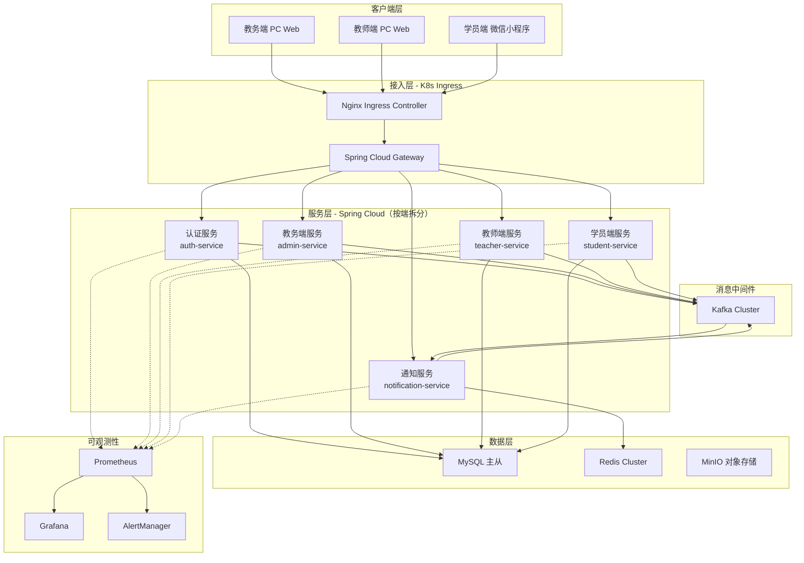
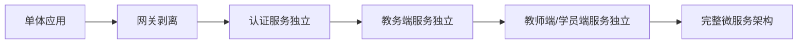
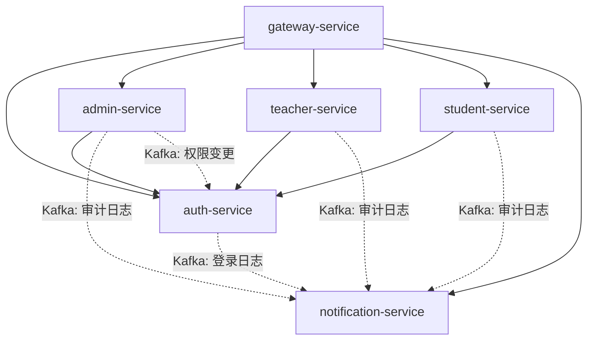
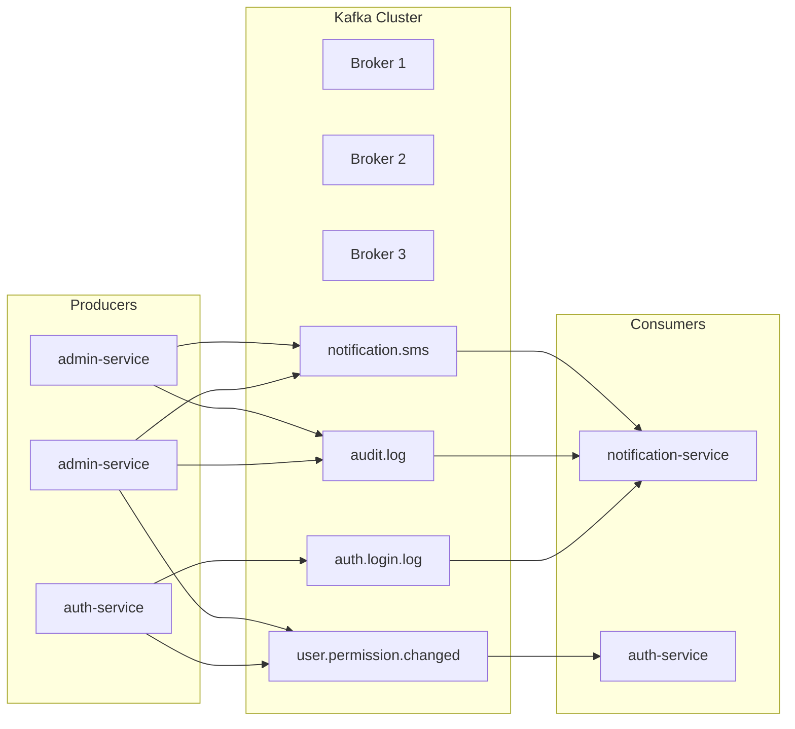
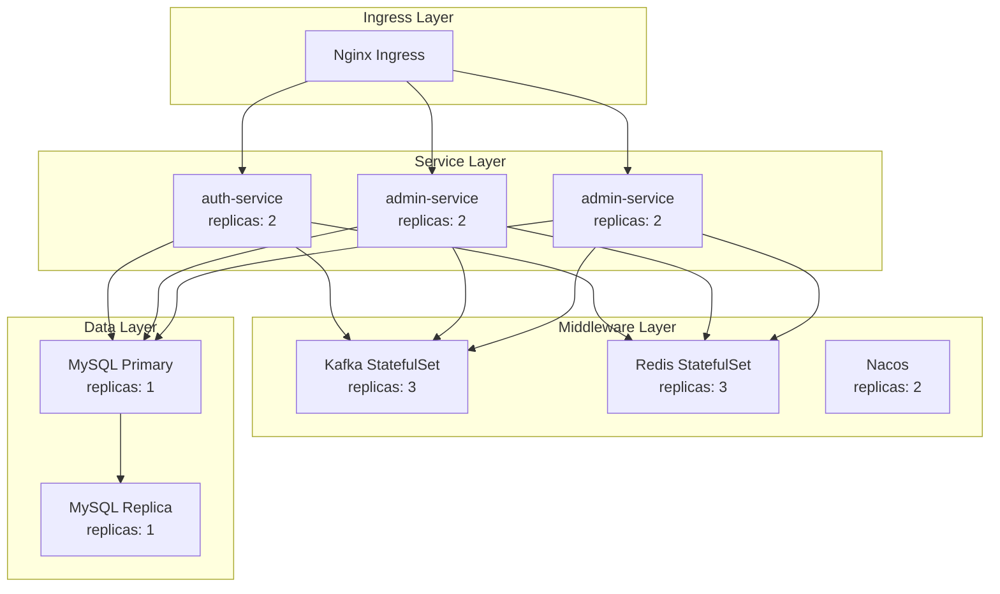
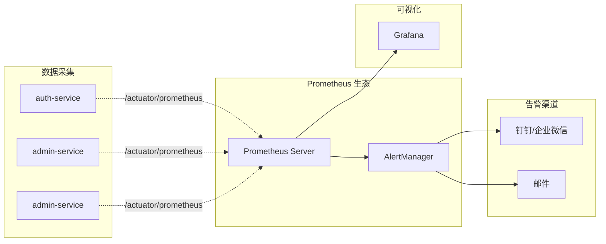

# ChordSked 云原生架构重构计划

**版本**: v1.0
**创建日期**: 2026-04-29
**状态**: 规划中

---

## 1. 重构背景与目标

### 1.1 当前架构分析

| 维度 | 当前状态 | 痛点 |
|------|----------|------|
| 部署方式 | 单体应用 | 无法独立扩展，资源利用率低 |
| 服务通信 | 同步调用 | 耦合度高，无异步解耦 |
| 监控运维 | 基础日志 | 缺乏可视化监控和告警 |
| 容器化 | 无 | 环境不一致，部署效率低 |

### 1.2 重构目标

```
单体应用 → 微服务架构
物理机部署 → K8s 云原生部署
基础日志 → Prometheus + Grafana 可观测体系
同步调用 → Kafka 异步解耦
```

### 1.3 目标架构图



---

## 2. 微服务拆分方案

### 2.1 服务拆分策略

基于业务分析，系统存在三套完全独立的账号体系，采用**按端拆分**策略：



**为什么选择按端拆分**：
1. **三端账号体系独立**：三张用户表，无共享逻辑
2. **权限模型差异大**：仅教务端需要 RBAC，教师/学员端只需简单角色验证
3. **部署独立性强**：三端可独立扩缩容，互不影响

### 2.2 服务划分（按端拆分策略）

基于业务分析，系统存在三套完全独立的账号体系，且三端功能差异显著：
- **教务端**：唯一需要完整 RBAC 权限控制
- **教师端**：简单角色验证，无细粒度权限
- **学员端**：简单角色验证，无细粒度权限

因此采用**按端拆分**策略，而非传统的按功能领域拆分：

| 服务名 | 职责 | 核心表 | 优先级 |
|--------|------|--------|--------|
| `gateway-service` | API网关、路由、限流 | - | P0 |
| `auth-service` | 统一认证、Token管理 | sys_internal_user, sys_teacher_user, sys_student_user | P0 |
| `admin-service` | **教务端全部功能**：内部用户管理、RBAC、校区管理 | sys_internal_user, sys_role, sys_permission, sys_campus | P0 |
| `teacher-service` | **教师端全部功能**：教师管理、排课、课表 | sys_teacher_user, (未来) schedule, course | P1 |
| `student-service` | **学员端全部功能**：学员管理、课程、练琴记录 | sys_student_user, (未来) practice_log | P1 |
| `notification-service` | 消息通知、短信、日志消费 | sys_login_log, sys_audit_log | P1 |

### 2.3 服务依赖关系



**关键说明**：
- `admin-service` 包含教务端所有功能，包括 InternalUser 管理、角色权限管理、校区管理
- `auth-service` 负责三端统一认证，需要调用各端的用户查询接口
- 各端服务只需与 `auth-service` 交互，不需要相互调用

### 2.4 Spring Cloud 技术选型

| 组件 | 选型 | 说明 |
|------|------|------|
| 注册中心 | Nacos | 服务注册与配置中心 |
| 网关 | Spring Cloud Gateway | 替代 Zuul |
| 负载均衡 | Spring Cloud LoadBalancer | 替代 Ribbon |
| 服务调用 | OpenFeign | 声明式 HTTP 客户端 |
| 熔断降级 | Sentinel | 流量控制、熔断降级 |
| 配置中心 | Nacos Config | 统一配置管理 |

### 2.5 父工程结构（按端拆分）

```
chordsked/
├── pom.xml                          # 父 POM
├── chordsked-common/                # 公共模块
│   ├── chordsked-common-core/       # 核心工具类
│   ├── chordsked-common-redis/      # Redis 封装
│   ├── chordsked-common-kafka/      # Kafka 封装
│   ├── chordsked-common-security/   # 安全组件
│   └── chordsked-common-web/        # Web 通用配置
├── chordsked-gateway/               # API 网关
├── chordsked-auth/                  # 统一认证服务
├── chordsked-admin/                 # 教务端服务（包含 InternalUser + RBAC + 校区）
├── chordsked-teacher/               # 教师端服务（包含教师管理 + 排课）
├── chordsked-student/               # 学员端服务（包含学员管理 + 课程）
├── chordsked-notification/          # 通知服务（Kafka 消费者）
└── deploy/                          # 部署配置
    ├── docker/
    └── k8s/
```

---

## 3. Spring Cloud 项目结构详解

### 3.1 当前代码结构分析

```
backend/src/main/java/com/chordsked/backend/
├── audit/                 # 审计日志模块
├── cache/                 # 缓存层 (auth, security)
├── common/                # 公共组件 (ApiResponse, PageResult)
├── config/                # 配置类
├── controller/            # 控制器层
│   ├── AuthController.java
│   ├── InternalUserController.java
│   ├── RoleController.java
│   ├── PermissionController.java
│   └── StudentController.java
├── dao/                   # 数据访问层
├── datascope/             # 数据权限拦截
├── exception/             # 异常处理
├── idempotent/            # 幂等性组件
├── model/                 # 模型层
│   ├── entity/
│   ├── dto/
│   ├── vo/
│   └── enums/
├── security/              # 安全模块 (JWT, Spring Security)
├── service/               # 业务层
│   ├── auth/
│   ├── internaluser/
│   ├── role/
│   ├── permission/
│   ├── campus/
│   ├── student/
│   └── verification/
└── utils/                 # 工具类
```

### 3.2 公共模块与业务模块划分

#### 3.2.1 组件归属决策

| 组件 | 归属 | 原因 |
|------|------|------|
| `cache/` (Redis) | `common-redis` | 所有服务都需要 Redis |
| `idempotent/` | `common-web` | 写操作服务按需启用 |
| `security/jwt/` | `common-security` | auth-service + gateway 需要 |
| `security/account/` | `auth-service` | 认证核心逻辑，其他服务不需要 |
| `security/config/` | 各服务自行配置 | Spring Security 配置因服务而异 |
| `datascope/` | `admin-service` | **只有教务端需要数据权限** |
| `audit/` | `common-web` | 各服务按需启用 `@AuditLog` |

#### 3.2.2 公共模块结构

```
chordsked-common/
├── pom.xml
│
├── chordsked-common-core/                 # 核心工具（所有服务）
│   ├── src/main/java/com/chordsked/common/core/
│   │   ├── result/                        # 统一返回体
│   │   │   ├── ApiResponse.java
│   │   │   └── PageResult.java
│   │   ├── exception/                     # 异常定义
│   │   │   ├── BusinessException.java
│   │   │   └── ErrorCode.java
│   │   ├── enums/                         # 通用枚举
│   │   │   └── AccountUserType.java
│   │   └── utils/                         # 工具类
│   │       ├── JsonUtils.java
│   │       └── DateUtils.java
│   └── pom.xml
│
├── chordsked-common-redis/                # Redis 封装（所有服务）
│   ├── src/main/java/com/chordsked/common/redis/
│   │   ├── config/
│   │   │   └── RedisConfig.java
│   │   └── service/
│   │       ├── RedisService.java
│   │       └── RedisServiceImpl.java
│   └── pom.xml
│
├── chordsked-common-web/                  # Web 通用配置（所有服务）
│   ├── src/main/java/com/chordsked/common/web/
│   │   ├── config/
│   │   │   ├── WebMvcConfig.java
│   │   │   └── JacksonConfig.java
│   │   ├── handler/
│   │   │   └── GlobalExceptionHandler.java
│   │   ├── filter/
│   │   │   └── TraceIdFilter.java
│   │   ├── idempotent/                    # 幂等组件（可选启用）
│   │   │   ├── annotation/
│   │   │   │   └── Idempotent.java
│   │   │   ├── interceptor/
│   │   │   │   └── IdempotentInterceptor.java
│   │   │   └── config/
│   │   │       └── IdempotentConfig.java
│   │   └── audit/                         # 审计日志（可选启用）
│   │       ├── annotation/
│   │       │   └── AuditLog.java
│   │       └── aspect/
│   │           └── AuditLogAspect.java
│   └── pom.xml
│
├── chordsked-common-security/             # 安全组件（auth + gateway）
│   ├── src/main/java/com/chordsked/common/security/
│   │   ├── jwt/
│   │   │   ├── JwtTokenUtils.java
│   │   │   └── JwtProperties.java
│   │   └── context/
│   │       └── SecurityContext.java
│   └── pom.xml
│
└── chordsked-common-kafka/                # Kafka 封装（需要消息的服务）
    ├── src/main/java/com/chordsked/common/kafka/
    │   ├── config/
    │   │   └── KafkaConfig.java
    │   ├── producer/
    │   │   └── KafkaMessageProducer.java
    │   └── message/
    │       ├── BaseMessage.java
    │       ├── LoginLogMessage.java
    │       └── PermissionChangedMessage.java
    └── pom.xml
```

#### 3.2.3 业务服务结构
├── chordsked-gateway/                         # API 网关
│   ├── pom.xml
│   └── src/main/java/com/chordsked/gateway/
│       ├── GatewayApplication.java
│       ├── config/
│       │   ├── RouteConfig.java
│       │   └── CorsConfig.java
│       ├── filter/
│       │   ├── AuthGlobalFilter.java
│       │   └── TraceIdFilter.java
│       └── handler/
│           └── GlobalExceptionHandler.java
│
├── chordsked-auth/                            # 统一认证服务
│   ├── pom.xml
│   └── src/main/java/com/chordsked/auth/
│       ├── AuthApplication.java
│       ├── controller/
│       │   └── AuthController.java
│       ├── service/
│       │   ├── AuthLoginService.java
│       │   ├── AuthLogoutService.java
│       │   └── AuthRefreshService.java
│       ├── provider/                          # 三端账号提供者
│       │   ├── AccountProvider.java           # 接口
│       │   ├── AdminAccountProvider.java      # 教务端
│       │   ├── TeacherAccountProvider.java    # 教师端
│       │   └── StudentAccountProvider.java    # 学员端
│       ├── cache/
│       │   └── SecurityCacheService.java
│       └── client/                            # Feign 客户端
│           ├── AdminClient.java
│           ├── TeacherClient.java
│           └── StudentClient.java
│
├── chordsked-admin/                           # 教务端服务（完整功能）
│   ├── pom.xml
│   └── src/main/java/com/chordsked/admin/
│       ├── AdminApplication.java
│       ├── controller/
│       │   ├── InternalUserController.java    # 教务用户管理
│       │   ├── RoleController.java            # 角色管理
│       │   ├── PermissionController.java      # 权限管理
│       │   └── CampusController.java          # 校区管理
│       ├── service/
│       │   ├── InternalUserService.java
│       │   ├── RoleService.java
│       │   ├── PermissionService.java
│       │   └── CampusService.java
│       ├── dao/
│       │   ├── InternalUserDao.java
│       │   ├── RoleDao.java
│       │   ├── PermissionDao.java
│       │   └── CampusDao.java
│       ├── model/
│       │   ├── entity/
│       │   │   ├── InternalUserEntity.java
│       │   │   ├── RoleEntity.java
│       │   │   ├── PermissionEntity.java
│       │   │   └── CampusEntity.java
│       │   ├── dto/
│       │   └── vo/
│       └── client/
│           └── AuthClient.java                # 调用认证服务
│
├── chordsked-teacher/                         # 教师端服务
│   ├── pom.xml
│   └── src/main/java/com/chordsked/teacher/
│       ├── TeacherApplication.java
│       ├── controller/
│       │   ├── TeacherUserController.java     # 教师管理
│       │   └── ScheduleController.java        # 排课管理（未来）
│       ├── service/
│       │   ├── TeacherUserService.java
│       │   └── ScheduleService.java           # （未来）
│       ├── dao/
│       │   └── TeacherUserDao.java
│       ├── model/
│       │   ├── entity/
│       │   │   └── TeacherUserEntity.java
│       │   ├── dto/
│       │   └── vo/
│       └── client/
│           └── AuthClient.java
│
├── chordsked-student/                         # 学员端服务
│   ├── pom.xml
│   └── src/main/java/com/chordsked/student/
│       ├── StudentApplication.java
│       ├── controller/
│       │   └── StudentUserController.java     # 学员管理
│       ├── service/
│       │   └── StudentUserService.java
│       ├── dao/
│       │   └── StudentUserDao.java
│       ├── model/
│       │   ├── entity/
│       │   │   └── StudentUserEntity.java
│       │   ├── dto/
│       │   └── vo/
│       └── client/
│           └── AuthClient.java
│
├── chordsked-notification/                    # 通知服务（Kafka 消费者）
│   ├── pom.xml
│   └── src/main/java/com/chordsked/notification/
│       ├── NotificationApplication.java
│       ├── consumer/
│       │   ├── LoginLogConsumer.java
│       │   └── AuditLogConsumer.java
│       └── service/
│           ├── LoginLogService.java
│           └── SmsService.java
│
└── deploy/                                    # 部署配置
    ├── docker/
    └── k8s/
```

### 3.3 父 POM 配置

```xml
<?xml version="1.0" encoding="UTF-8"?>
<project xmlns="http://maven.apache.org/POM/4.0.0"
         xmlns:xsi="http://www.w3.org/2001/XMLSchema-instance"
         xsi:schemaLocation="http://maven.apache.org/POM/4.0.0 
         http://maven.apache.org/xsd/maven-4.0.0.xsd">
    <modelVersion>4.0.0</modelVersion>

    <groupId>com.chordsked</groupId>
    <artifactId>chordsked-parent</artifactId>
    <version>1.0.0-SNAPSHOT</version>
    <packaging>pom</packaging>
    <name>ChordSked Parent</name>

    <modules>
        <module>chordsked-common</module>
        <module>chordsked-common/chordsked-common-core</module>
        <module>chordsked-common/chordsked-common-redis</module>
        <module>chordsked-common/chordsked-common-kafka</module>
        <module>chordsked-common/chordsked-common-security</module>
        <module>chordsked-common/chordsked-common-web</module>
        <module>chordsked-gateway</module>
        <module>chordsked-auth</module>
        <module>chordsked-admin</module>
        <module>chordsked-teacher</module>
        <module>chordsked-student</module>
        <module>chordsked-notification</module>
    </modules>

    <properties>
        <java.version>17</java.version>
        <spring-boot.version>3.3.0</spring-boot.version>
        <spring-cloud.version>2023.0.1</spring-cloud.version>
        <spring-cloud-alibaba.version>2023.0.1.0</spring-cloud-alibaba.version>
        <mybatis-plus.version>3.5.5</mybatis-plus.version>
        <jwt.version>0.12.7</jwt.version>
    </properties>

    <dependencyManagement>
        <dependencies>
            <!-- Spring Boot -->
            <dependency>
                <groupId>org.springframework.boot</groupId>
                <artifactId>spring-boot-dependencies</artifactId>
                <version>${spring-boot.version}</version>
                <type>pom</type>
                <scope>import</scope>
            </dependency>
            
            <!-- Spring Cloud -->
            <dependency>
                <groupId>org.springframework.cloud</groupId>
                <artifactId>spring-cloud-dependencies</artifactId>
                <version>${spring-cloud.version}</version>
                <type>pom</type>
                <scope>import</scope>
            </dependency>
            
            <!-- Spring Cloud Alibaba -->
            <dependency>
                <groupId>com.alibaba.cloud</groupId>
                <artifactId>spring-cloud-alibaba-dependencies</artifactId>
                <version>${spring-cloud-alibaba.version}</version>
                <type>pom</type>
                <scope>import</scope>
            </dependency>
            
            <!-- 内部模块 -->
            <dependency>
                <groupId>com.chordsked</groupId>
                <artifactId>chordsked-common-core</artifactId>
                <version>${project.version}</version>
            </dependency>
            <dependency>
                <groupId>com.chordsked</groupId>
                <artifactId>chordsked-common-redis</artifactId>
                <version>${project.version}</version>
            </dependency>
            <dependency>
                <groupId>com.chordsked</groupId>
                <artifactId>chordsked-common-kafka</artifactId>
                <version>${project.version}</version>
            </dependency>
            <dependency>
                <groupId>com.chordsked</groupId>
                <artifactId>chordsked-common-security</artifactId>
                <version>${project.version}</version>
            </dependency>
            <dependency>
                <groupId>com.chordsked</groupId>
                <artifactId>chordsked-common-web</artifactId>
                <version>${project.version}</version>
            </dependency>
        </dependencies>
    </dependencyManagement>
</project>
```

### 3.4 数据库拆分策略

#### 3.4.1 当前表结构分析

```
┌─────────────────────────────────────────────────────────────┐
│                     教务端专属表 (admin-service)             │
├─────────────────────────────────────────────────────────────┤
│  sys_internal_user      sys_role         sys_permission     │
│  sys_user_role          sys_role_permission                  │
│  sys_user_campus        sys_data_scope                       │
├─────────────────────────────────────────────────────────────┤
│                     共享基础数据                             │
├─────────────────────────────────────────────────────────────┤
│  sys_campus  ←─── 被教师端、学员端引用                       │
├─────────────────────────────────────────────────────────────┤
│  教师端表 (teacher-service)    学员端表 (student-service)    │
│  sys_teacher_user              sys_student_user              │
├─────────────────────────────────────────────────────────────┤
│                     日志表 (notification-service)             │
│  sys_login_log    sys_audit_log    sys_operation_log        │
└─────────────────────────────────────────────────────────────┘
```

#### 3.4.2 推荐方案：共享数据库 + 表归属划分

**为什么不建议独立数据库**：

| 问题 | 说明 |
|------|------|
| 外键约束失效 | `sys_campus` 被三端引用，拆分后跨库外键失效 |
| 分布式事务 | 需要 Saga/TCC，复杂度激增 |
| 运维成本 | 多数据库实例维护成本高 |

**推荐策略**：所有服务共享一个数据库，按表归属划分管理权限

| 服务 | 管理的表 | 访问权限 |
|------|---------|---------|
| `admin-service` | sys_internal_user, sys_role, sys_permission, sys_user_role, sys_role_permission, sys_user_campus, sys_data_scope, sys_campus | 读写 |
| `teacher-service` | sys_teacher_user | 读写 + 只读 sys_campus |
| `student-service` | sys_student_user | 读写 + 只读 sys_campus |
| `notification-service` | sys_login_log, sys_audit_log, sys_operation_log | 读写 |

#### 3.4.3 关联表归属原则

| 表 | 归属服务 | 原因 |
|---|---------|------|
| `sys_user_role` | admin-service | 用户和角色都是教务端概念 |
| `sys_role_permission` | admin-service | 角色和权限都是教务端概念 |
| `sys_user_campus` | admin-service | 教务用户的校区绑定 |

#### 3.4.4 共享表访问方案

**sys_campus 被教师端/学员端引用，两种处理方式**：

**方案 A：通过 API 访问（推荐）**

```java
// admin-service 暴露内部接口
@RestController
@RequestMapping("/internal/api/v1/campus")
public class CampusInternalController {

    @GetMapping("/{campusId}")
    public CampusDTO getCampusById(@PathVariable Long campusId) { ... }

    @GetMapping("/batch")
    public List<CampusDTO> getCampusByIds(@RequestParam List<Long> ids) { ... }
}

// teacher-service 通过 Feign 调用
@FeignClient(name = "chordsked-admin", path = "/internal/api/v1")
public interface AdminClient {
    @GetMapping("/campus/{campusId}")
    CampusDTO getCampusById(@PathVariable Long campusId);
}
```

**方案 B：共享只读访问（简化）**

```yaml
# teacher-service 可以只读访问 sys_campus 表
# 写入操作必须通过 admin-service
spring:
  datasource:
    url: jdbc:mysql://localhost:3306/chordsked_db
```

#### 3.4.5 数据库权限控制（生产环境）

```sql
-- admin-service 用户：完全控制教务端表
GRANT ALL PRIVILEGES ON chordsked_db.sys_* TO 'admin_user'@'%';

-- teacher-service 用户：只能操作教师表，只读校区表
GRANT SELECT, INSERT, UPDATE, DELETE ON chordsked_db.sys_teacher_user TO 'teacher_user'@'%';
GRANT SELECT ON chordsked_db.sys_campus TO 'teacher_user'@'%';

-- student-service 用户：只能操作学员表，只读校区表
GRANT SELECT, INSERT, UPDATE, DELETE ON chordsked_db.sys_student_user TO 'student_user'@'%';
GRANT SELECT ON chordsked_db.sys_campus TO 'student_user'@'%';
```

#### 3.4.6 新增表归属判断

```
新增表时判断归属：

1. 主要使用者是哪个端？
   → 教务端 → admin-service 管理
   → 教师端 → teacher-service 管理
   → 学员端 → student-service 管理

2. 是否有跨端访问需求？
   → 有 → 通过 API 暴露，或放共享区域

3. 是否需要外键关联其他端表？
   → 是 → 使用逻辑关联，不建物理外键
   → 否 → 可以建物理外键
```

### 3.5 服务与 common 模块依赖关系

| 服务 | 依赖的 common 模块 | 说明 |
|------|-------------------|------|
| `gateway` | common-core, common-security, common-redis | JWT 验证 + 路由 |
| `auth-service` | common-core, common-security, common-redis, common-kafka, common-web | 认证 + Token 缓存 + 发送日志消息 |
| `admin-service` | common-core, common-redis, common-kafka, common-web | 教务端业务 + 发送审计日志 |
| `teacher-service` | common-core, common-redis, common-kafka, common-web | 教师端业务 |
| `student-service` | common-core, common-redis, common-kafka, common-web | 学员端业务 |
| `notification-service` | common-core, common-redis, common-kafka, common-web | 消费日志消息 |

**关键说明**：
- `common-security` 只有 `gateway` 和 `auth-service` 需要
- `common-kafka` 所有业务服务都需要（发送日志/事件）
- `datascope/` 放在 `admin-service` 内部，不抽到 common

### 3.5 代码拆分映射表（按端拆分）

#### auth-service (统一认证服务)

| 原路径 | 目标路径 | 说明 |
|--------|----------|------|
| `controller/AuthController.java` | `chordsked-auth/controller/` | 登录/登出/刷新 |
| `service/auth/*` | `chordsked-auth/service/` | 认证服务 |
| `service/verification/*` | `chordsked-auth/verification/` | 登录验证策略 |
| `security/account/provider/*` | `chordsked-auth/provider/` | 三端账号提供者 |
| `cache/auth/*` | `chordsked-auth/cache/` | 认证缓存 |
| `cache/security/*` | `chordsked-auth/cache/` | 安全缓存 |
| `model/auth/*` | `chordsked-auth/model/` | 认证模型 |
| `model/dto/auth/*` | `chordsked-auth/model/dto/` | 认证 DTO |
| `model/vo/auth/*` | `chordsked-auth/model/vo/` | 认证 VO |

#### admin-service (教务端服务 - 完整功能)

| 原路径 | 目标路径 | 说明 |
|--------|----------|------|
| `controller/InternalUserController.java` | `chordsked-admin/controller/` | 教务用户管理 |
| `controller/RoleController.java` | `chordsked-admin/controller/` | 角色管理 |
| `controller/PermissionController.java` | `chordsked-admin/controller/` | 权限管理 |
| `service/internaluser/*` | `chordsked-admin/service/internaluser/` | 教务用户服务 |
| `service/role/*` | `chordsked-admin/service/role/` | 角色服务 |
| `service/permission/*` | `chordsked-admin/service/permission/` | 权限服务 |
| `service/campus/*` | `chordsked-admin/service/campus/` | 校区服务 |
| `model/entity/InternalUserEntity.java` | `chordsked-admin/model/entity/` | 教务用户实体 |
| `model/entity/RoleEntity.java` | `chordsked-admin/model/entity/` | 角色实体 |
| `model/entity/PermissionEntity.java` | `chordsked-admin/model/entity/` | 权限实体 |
| `model/entity/CampusEntity.java` | `chordsked-admin/model/entity/` | 校区实体 |
| `dao/InternalUserDao.java` | `chordsked-admin/dao/` | 教务用户 DAO |
| `dao/RoleDao.java` | `chordsked-admin/dao/` | 角色 DAO |
| `dao/PermissionDao.java` | `chordsked-admin/dao/` | 权限 DAO |
| `dao/CampusDao.java` | `chordsked-admin/dao/` | 校区 DAO |
| `datascope/*` | `chordsked-admin/datascope/` | 数据权限组件（仅教务端使用）|

#### teacher-service (教师端服务)

| 原路径 | 目标路径 | 说明 |
|--------|----------|------|
| - | `chordsked-teacher/controller/TeacherUserController.java` | 教师管理（新建）|
| `model/entity/TeacherUserEntity.java` | `chordsked-teacher/model/entity/` | 教师实体 |
| `dao/TeacherUserDao.java` | `chordsked-teacher/dao/` | 教师 DAO |
| `service/student/*` (部分) | `chordsked-teacher/service/` | 教师相关服务 |

#### student-service (学员端服务)

| 原路径 | 目标路径 | 说明 |
|--------|----------|------|
| `controller/StudentController.java` | `chordsked-student/controller/StudentUserController.java` | 学员管理 |
| `model/entity/StudentUserEntity.java` | `chordsked-student/model/entity/` | 学员实体 |
| `dao/StudentUserDao.java` | `chordsked-student/dao/` | 学员 DAO |
| `service/student/*` | `chordsked-student/service/` | 学员服务 |

#### common 模块 (公共组件)

| 原路径 | 目标模块 | 说明 |
|--------|----------|------|
| `common/ApiResponse.java` | `chordsked-common-core` | 统一返回体 |
| `common/PageResult.java` | `chordsked-common-core` | 分页结果 |
| `exception/*` | `chordsked-common-core` | 异常定义 |
| `model/enums/*` | `chordsked-common-core` | 通用枚举 |
| `utils/*` | `chordsked-common-core` | 工具类 |
| `cache/` (Redis 相关) | `chordsked-common-redis` | Redis 封装 |
| `idempotent/*` | `chordsked-common-web` | 幂等组件 |
| `audit/*` | `chordsked-common-web` | 审计日志 |
| `config/RequestIdFilter.java` | `chordsked-common-web` | TraceId 过滤器 |
| `utils/jwt/*` | `chordsked-common-security` | JWT 工具类 |

---

## 4. 服务间通信设计

### 4.1 OpenFeign 客户端定义（按端拆分）

#### 认证服务调用各端服务

```java
// chordsked-auth/client/AdminClient.java
package com.chordsked.auth.client;

import com.chordsked.common.core.result.ApiResponse;
import org.springframework.cloud.openfeign.FeignClient;
import org.springframework.web.bind.annotation.GetMapping;
import org.springframework.web.bind.annotation.PathVariable;

@FeignClient(name = "chordsked-admin", path = "/internal/api/v1")
public interface AdminClient {

    @GetMapping("/users/{userId}")
    ApiResponse<AdminUserDTO> getUserById(@PathVariable Long userId);

    @GetMapping("/users/{userId}/permissions")
    ApiResponse<PermissionInfoDTO> getUserPermissions(@PathVariable Long userId);
}
```

```java
// chordsked-auth/client/TeacherClient.java
package com.chordsked.auth.client;

import com.chordsked.common.core.result.ApiResponse;
import org.springframework.cloud.openfeign.FeignClient;
import org.springframework.web.bind.annotation.GetMapping;
import org.springframework.web.bind.annotation.PathVariable;

@FeignClient(name = "chordsked-teacher", path = "/teachers/api/v1")
public interface TeacherClient {

    @GetMapping("/users/{userId}")
    ApiResponse<TeacherUserDTO> getUserById(@PathVariable Long userId);
}
```

```java
// chordsked-auth/client/StudentClient.java
package com.chordsked.auth.client;

import com.chordsked.common.core.result.ApiResponse;
import org.springframework.cloud.openfeign.FeignClient;
import org.springframework.web.bind.annotation.GetMapping;
import org.springframework.web.bind.annotation.PathVariable;

@FeignClient(name = "chordsked-student", path = "/students/api/v1")
public interface StudentClient {

    @GetMapping("/users/{userId}")
    ApiResponse<StudentUserDTO> getUserById(@PathVariable Long userId);
}
```

#### 各端服务调用认证服务

```java
// chordsked-admin/client/AuthClient.java (各端服务都有类似的客户端)
package com.chordsked.admin.client;

import com.chordsked.common.core.result.ApiResponse;
import org.springframework.cloud.openfeign.FeignClient;
import org.springframework.web.bind.annotation.PostMapping;
import org.springframework.web.bind.annotation.RequestBody;

@FeignClient(name = "chordsked-auth", path = "/api/v1")
public interface AuthClient {

    @PostMapping("/invalidate-token")
    ApiResponse<Void> invalidateToken(@RequestBody TokenInvalidateRequest request);
}
```

### 4.2 服务调用场景（按端拆分）

| 场景 | 调用方 | 被调用方 | 方式 | 说明 |
|------|--------|----------|------|------|
| 教务端登录验证 | auth-service | admin-service | Feign | 获取教务用户信息和权限 |
| 教师端登录验证 | auth-service | teacher-service | Feign | 获取教师信息 |
| 学员端登录验证 | auth-service | student-service | Feign | 获取学员信息 |
| 权限变更后失效 Token | admin-service | auth-service | Kafka | 异步通知清理缓存 |
| 用户状态变更强制下线 | admin-service | auth-service | Kafka | 异步通知吊销 Token |
| 记录登录日志 | auth-service | notification-service | Kafka | 异步写入日志 |
| 记录审计日志 | admin/teacher/student | notification-service | Kafka | 异步写入日志 |

### 4.3 网关路由配置（按端拆分）

```yaml
# chordsked-gateway/src/main/resources/application.yml
spring:
  cloud:
    gateway:
      routes:
        # ==================== 认证服务路由 ====================
        - id: auth-service
          uri: lb://chordsked-auth
          predicates:
            - Path=/admin/api/v1/auth/**,/teachers/api/v1/auth/**,/students/api/v1/auth/**
          filters:
            - StripPrefix=0

        # ==================== 教务端路由 ====================
        - id: admin-service
          uri: lb://chordsked-admin
          predicates:
            - Path=/admin/api/v1/**
          filters:
            - StripPrefix=0

        # ==================== 教师端路由 ====================
        - id: teacher-service
          uri: lb://chordsked-teacher
          predicates:
            - Path=/teachers/api/v1/**
          filters:
            - StripPrefix=0

        # ==================== 学员端路由 ====================
        - id: student-service
          uri: lb://chordsked-student
          predicates:
            - Path=/students/api/v1/**
          filters:
            - StripPrefix=0
```

**路由说明**：
- `/admin/api/v1/**` → 教务端所有请求都路由到 `chordsked-admin`
- `/teachers/api/v1/**` → 教师端所有请求都路由到 `chordsked-teacher`
- `/students/api/v1/**` → 学员端所有请求都路由到 `chordsked-student`
- 认证相关接口 `/auth/**` 由 `auth-service` 处理

---

## 5. Kafka 接入详解

### 5.1 应用场景

| 场景 | Producer | Consumer | Topic | 说明 |
|------|----------|----------|-------|------|
| 登录日志 | auth-service | notification-service | `auth.login.log` | 异步记录登录日志 |
| 审计日志 | 各业务服务 | notification-service | `audit.log` | 异步记录操作日志 |
| 短信通知 | 各业务服务 | notification-service | `notification.sms` | 异步发送短信 |
| 权限变更 | admin-service | auth-service | `user.permission.changed` | 清理权限缓存 |
| 用户状态变更 | admin-service | auth-service | `user.status.changed` | 强制下线 |

### 5.2 Kafka 架构



### 5.3 消息格式设计

```json
{
  "messageId": "uuid",
  "traceId": "a1b2c3d4e5f6",
  "timestamp": 1714358400000,
  "source": "auth-service",
  "eventType": "LOGIN_SUCCESS",
  "payload": {
    "userId": 1001,
    "userType": "INTERNAL",
    "loginIp": "192.168.1.1",
    "loginTime": "2026-04-29 10:30:00"
  }
}
```

### 5.4 公共 Kafka 模块实现

#### 5.4.1 基础消息类

```java
// chordsked-common-kafka/src/main/java/com/chordsked/common/kafka/message/BaseMessage.java
package com.chordsked.common.kafka.message;

import lombok.Data;
import java.io.Serializable;
import java.time.Instant;

@Data
public abstract class BaseMessage implements Serializable {
    
    private String messageId;
    private String traceId;
    private Instant timestamp;
    private String source;
    private String eventType;
    
    public BaseMessage() {
        this.messageId = java.util.UUID.randomUUID().toString();
        this.timestamp = Instant.now();
    }
}
```

#### 5.4.2 登录日志消息

```java
// chordsked-common-kafka/src/main/java/com/chordsked/common/kafka/message/LoginLogMessage.java
package com.chordsked.common.kafka.message;

import lombok.Data;
import lombok.EqualsAndHashCode;

@Data
@EqualsAndHashCode(callSuper = true)
public class LoginLogMessage extends BaseMessage {
    
    private Long userId;
    private String userType;
    private String loginIp;
    private String loginMethod;
    private Boolean success;
    private String failReason;
    
    public static final String TOPIC = "auth.login.log";
    
    public enum EventType {
        LOGIN_SUCCESS,
        LOGIN_FAILED,
        LOGOUT
    }
}
```

#### 5.4.3 权限变更消息

```java
// chordsked-common-kafka/src/main/java/com/chordsked/common/kafka/message/PermissionChangedMessage.java
package com.chordsked.common.kafka.message;

import lombok.Data;
import lombok.EqualsAndHashCode;
import java.util.List;

@Data
@EqualsAndHashCode(callSuper = true)
public class PermissionChangedMessage extends BaseMessage {
    
    private Long userId;
    private String userType;
    private ChangeType changeType;
    private List<String> changedPermissionCodes;
    
    public static final String TOPIC = "user.permission.changed";
    
    public enum ChangeType {
        ROLE_CHANGED,       // 角色变更
        PERMISSION_ADDED,   // 权限新增
        PERMISSION_REMOVED, // 权限移除
        USER_STATUS_CHANGED // 用户状态变更
    }
}
```

#### 5.4.4 Kafka 生产者封装

```java
// chordsked-common-kafka/src/main/java/com/chordsked/common/kafka/producer/KafkaMessageProducer.java
package com.chordsked.common.kafka.producer;

import com.chordsked.common.kafka.message.BaseMessage;
import lombok.extern.slf4j.Slf4j;
import org.springframework.kafka.core.KafkaTemplate;
import org.springframework.kafka.support.SendResult;
import org.springframework.stereotype.Component;

import jakarta.annotation.Resource;
import java.util.concurrent.CompletableFuture;

@Slf4j
@Component
public class KafkaMessageProducer {

    @Resource
    private KafkaTemplate<String, Object> kafkaTemplate;

    /**
     * 发送消息（异步，不等待确认）
     */
    public <T extends BaseMessage> void sendAsync(String topic, String key, T message) {
        CompletableFuture<SendResult<String, Object>> future = kafkaTemplate.send(topic, key, message);
        
        future.whenComplete((result, ex) -> {
            if (ex != null) {
                log.error("Failed to send message to topic: {}, key: {}", topic, key, ex);
            } else {
                log.debug("Message sent successfully to topic: {}, partition: {}, offset: {}", 
                    topic, result.getRecordMetadata().partition(), result.getRecordMetadata().offset());
            }
        });
    }

    /**
     * 发送消息（同步，等待确认）
     */
    public <T extends BaseMessage> void sendSync(String topic, String key, T message) {
        try {
            SendResult<String, Object> result = kafkaTemplate.send(topic, key, message).get();
            log.debug("Message sent successfully to topic: {}, partition: {}, offset: {}", 
                topic, result.getRecordMetadata().partition(), result.getRecordMetadata().offset());
        } catch (Exception e) {
            log.error("Failed to send message to topic: {}, key: {}", topic, key, e);
            throw new RuntimeException("Kafka message send failed", e);
        }
    }
}
```

#### 5.4.5 Kafka 配置类

```java
// chordsked-common-kafka/src/main/java/com/chordsked/common/kafka/config/KafkaConfig.java
package com.chordsked.common.kafka.config;

import org.apache.kafka.clients.producer.ProducerConfig;
import org.apache.kafka.clients.consumer.ConsumerConfig;
import org.apache.kafka.common.serialization.StringSerializer;
import org.apache.kafka.common.serialization.StringDeserializer;
import org.springframework.beans.factory.annotation.Value;
import org.springframework.context.annotation.Bean;
import org.springframework.context.annotation.Configuration;
import org.springframework.kafka.core.*;
import org.springframework.kafka.support.serializer.JsonSerializer;
import org.springframework.kafka.support.serializer.JsonDeserializer;
import org.springframework.kafka.annotation.EnableKafka;

import java.util.HashMap;
import java.util.Map;

@Configuration
@EnableKafka
public class KafkaConfig {

    @Value("${spring.kafka.bootstrap-servers}")
    private String bootstrapServers;

    // ==================== Producer 配置 ====================
    
    @Bean
    public ProducerFactory<String, Object> producerFactory() {
        Map<String, Object> config = new HashMap<>();
        config.put(ProducerConfig.BOOTSTRAP_SERVERS_CONFIG, bootstrapServers);
        config.put(ProducerConfig.KEY_SERIALIZER_CLASS_CONFIG, StringSerializer.class);
        config.put(ProducerConfig.VALUE_SERIALIZER_CLASS_CONFIG, JsonSerializer.class);
        config.put(ProducerConfig.ACKS_CONFIG, "all");
        config.put(ProducerConfig.RETRIES_CONFIG, 3);
        config.put(ProducerConfig.ENABLE_IDEMPOTENCE_CONFIG, true);
        config.put(JsonSerializer.ADD_TYPE_INFO_HEADERS, false);
        return new DefaultKafkaProducerFactory<>(config);
    }

    @Bean
    public KafkaTemplate<String, Object> kafkaTemplate() {
        return new KafkaTemplate<>(producerFactory());
    }

    // ==================== Consumer 配置 ====================
    
    @Bean
    public ConsumerFactory<String, Object> consumerFactory() {
        Map<String, Object> config = new HashMap<>();
        config.put(ConsumerConfig.BOOTSTRAP_SERVERS_CONFIG, bootstrapServers);
        config.put(ConsumerConfig.KEY_DESERIALIZER_CLASS_CONFIG, StringDeserializer.class);
        config.put(ConsumerConfig.VALUE_DESERIALIZER_CLASS_CONFIG, JsonDeserializer.class);
        config.put(ConsumerConfig.AUTO_OFFSET_RESET_CONFIG, "earliest");
        config.put(ConsumerConfig.ENABLE_AUTO_COMMIT_CONFIG, false);
        config.put(JsonDeserializer.TRUSTED_PACKAGES, "com.chordsked.*");
        config.put(JsonDeserializer.USE_TYPE_INFO_HEADERS, false);
        return new DefaultKafkaConsumerFactory<>(config);
    }
}
```

### 5.5 认证服务发送登录日志

```java
// chordsked-auth/src/main/java/com/chordsked/auth/service/impl/AuthLoginServiceImpl.java
package com.chordsked.auth.service.impl;

import com.chordsked.common.kafka.message.LoginLogMessage;
import com.chordsked.common.kafka.producer.KafkaMessageProducer;
import jakarta.annotation.Resource;
import org.springframework.stereotype.Service;

@Service("authLoginService")
public class AuthLoginServiceImpl implements AuthLoginService {

    @Resource
    private KafkaMessageProducer kafkaMessageProducer;

    @Override
    public LoginExecutionResult login(AuthLoginRequest request, AccountUserType userType, boolean secureRequest) {
        // ... 登录逻辑 ...
        
        // 发送登录日志到 Kafka
        sendLoginLog(loginResult, request, userType, true, null);
        
        return new LoginExecutionResult(...);
    }

    private void sendLoginLog(AuthLoginResultVO loginResult, AuthLoginRequest request, 
                              AccountUserType userType, boolean success, String failReason) {
        LoginLogMessage message = new LoginLogMessage();
        message.setSource("auth-service");
        message.setEventType(success ? "LOGIN_SUCCESS" : "LOGIN_FAILED");
        message.setUserId(loginResult.getUserId());
        message.setUserType(userType.getCode());
        message.setLoginIp(request.getClientIp());
        message.setLoginMethod(request.getLoginMethod().name());
        message.setSuccess(success);
        message.setFailReason(failReason);
        
        // 使用 userId 作为 key，保证同一用户的消息顺序
        kafkaMessageProducer.sendAsync(LoginLogMessage.TOPIC, String.valueOf(loginResult.getUserId()), message);
    }
}
```

### 5.6 通知服务消费登录日志

```java
// chordsked-notification/src/main/java/com/chordsked/notification/consumer/LoginLogConsumer.java
package com.chordsked.notification.consumer;

import com.chordsked.common.kafka.message.LoginLogMessage;
import com.chordsked.notification.service.LoginLogService;
import jakarta.annotation.Resource;
import lombok.extern.slf4j.Slf4j;
import org.springframework.kafka.annotation.KafkaListener;
import org.springframework.kafka.support.Acknowledgment;
import org.springframework.stereotype.Component;

@Slf4j
@Component
public class LoginLogConsumer {

    @Resource
    private LoginLogService loginLogService;

    @KafkaListener(
        topics = LoginLogMessage.TOPIC,
        groupId = "notification-service",
        containerFactory = "kafkaListenerContainerFactory"
    )
    public void consume(LoginLogMessage message, Acknowledgment acknowledgment) {
        log.info("Received login log message: userId={}, eventType={}", 
            message.getUserId(), message.getEventType());
        
        try {
            // 写入数据库
            loginLogService.saveLoginLog(message);
            
            // 手动提交 offset
            acknowledgment.acknowledge();
        } catch (Exception e) {
            log.error("Failed to process login log message: {}", message.getMessageId(), e);
            // 不 ack，让消息重新消费
            // 也可以发送到死信队列
        }
    }
}
```

### 5.7 用户服务发送权限变更消息

```java
// chordsked-user/src/main/java/com/chordsked/user/service/impl/RoleServiceImpl.java
package com.chordsked.user.service.impl;

import com.chordsked.common.kafka.message.PermissionChangedMessage;
import com.chordsked.common.kafka.producer.KafkaMessageProducer;
import jakarta.annotation.Resource;
import org.springframework.stereotype.Service;

@Service("roleService")
public class RoleServiceImpl implements RoleService {

    @Resource
    private KafkaMessageProducer kafkaMessageProducer;

    @Override
    @Transactional(rollbackFor = Exception.class)
    public void updateUserRoles(Long userId, List<Long> roleIds) {
        // ... 更新用户角色逻辑 ...
        
        // 发送权限变更消息，通知 auth-service 清理缓存
        sendPermissionChangedMessage(userId, PermissionChangedMessage.ChangeType.ROLE_CHANGED);
    }

    private void sendPermissionChangedMessage(Long userId, PermissionChangedMessage.ChangeType changeType) {
        PermissionChangedMessage message = new PermissionChangedMessage();
        message.setSource("admin-service");
        message.setEventType(changeType.name());
        message.setUserId(userId);
        message.setUserType("ADMIN");
        message.setChangeType(changeType);
        
        kafkaMessageProducer.sendAsync(PermissionChangedMessage.TOPIC, String.valueOf(userId), message);
    }
}
```

### 5.8 认证服务消费权限变更消息

```java
// chordsked-auth/src/main/java/com/chordsked/auth/consumer/PermissionChangedConsumer.java
package com.chordsked.auth.consumer;

import com.chordsked.common.kafka.message.PermissionChangedMessage;
import com.chordsked.auth.cache.SecurityCacheService;
import jakarta.annotation.Resource;
import lombok.extern.slf4j.Slf4j;
import org.springframework.kafka.annotation.KafkaListener;
import org.springframework.kafka.support.Acknowledgment;
import org.springframework.stereotype.Component;

@Slf4j
@Component
public class PermissionChangedConsumer {

    @Resource
    private SecurityCacheService securityCacheService;

    @KafkaListener(
        topics = PermissionChangedMessage.TOPIC,
        groupId = "auth-service",
        containerFactory = "kafkaListenerContainerFactory"
    )
    public void consume(PermissionChangedMessage message, Acknowledgment acknowledgment) {
        log.info("Received permission changed message: userId={}, changeType={}", 
            message.getUserId(), message.getChangeType());
        
        try {
            // 清理该用户的 Token 缓存，强制重新加载权限
            securityCacheService.invalidateUserTokens(message.getUserId(), message.getUserType());
            
            // 清理权限缓存
            securityCacheService.invalidatePermissionCache(message.getUserId(), message.getUserType());
            
            acknowledgment.acknowledge();
        } catch (Exception e) {
            log.error("Failed to process permission changed message: {}", message.getMessageId(), e);
        }
    }
}
```

### 5.9 application.yml Kafka 配置

```yaml
# 各微服务的 application.yml
spring:
  kafka:
    bootstrap-servers: ${KAFKA_BOOTSTRAP_SERVERS:localhost:9092}
    producer:
      acks: all
      retries: 3
      properties:
        enable.idempotence: true
    consumer:
      group-id: ${spring.application.name}
      auto-offset-reset: earliest
      enable-auto-commit: false  # 手动提交
      properties:
        spring.json.trusted.packages: "com.chordsked.*"
    listener:
      ack-mode: manual  # 手动确认模式
      concurrency: 3
```

### 5.10 幂等性处理

```java
// chordsked-common-kafka/src/main/java/com/chordsked/common/kafka/idempotent/MessageIdempotentService.java
package com.chordsked.common.kafka.idempotent;

import jakarta.annotation.Resource;
import org.springframework.data.redis.core.StringRedisTemplate;
import org.springframework.stereotype.Service;

import java.util.concurrent.TimeUnit;

@Service
public class MessageIdempotentService {

    @Resource
    private StringRedisTemplate stringRedisTemplate;

    private static final String IDEMPOTENT_KEY_PREFIX = "kafka:msg:";
    private static final long EXPIRE_HOURS = 24;

    /**
     * 检查消息是否已处理
     * @return true 表示未处理过，可以处理；false 表示已处理过
     */
    public boolean tryAcquire(String messageId) {
        String key = IDEMPOTENT_KEY_PREFIX + messageId;
        Boolean success = stringRedisTemplate.opsForValue()
            .setIfAbsent(key, "1", EXPIRE_HOURS, TimeUnit.HOURS);
        return Boolean.TRUE.equals(success);
    }
}
```

```java
// 在消费者中使用幂等检查
@KafkaListener(topics = LoginLogMessage.TOPIC, groupId = "notification-service")
public void consume(LoginLogMessage message, Acknowledgment acknowledgment) {
    // 幂等检查
    if (!messageIdempotentService.tryAcquire(message.getMessageId())) {
        log.warn("Message already processed: {}", message.getMessageId());
        acknowledgment.acknowledge();
        return;
    }
    
    try {
        loginLogService.saveLoginLog(message);
        acknowledgment.acknowledge();
    } catch (Exception e) {
        log.error("Failed to process message", e);
    }
}
```

### 5.11 本地开发环境 Docker Compose

```yaml
# docker-compose-kafka.yml
version: '3.8'
services:
  # 单节点 Kafka (KRaft 模式，无需 Zookeeper)
  kafka:
    image: bitnami/kafka:3.6
    container_name: chordsked-kafka
    ports:
      - "9092:9092"
    environment:
      # KRaft 模式配置
      KAFKA_CFG_NODE_ID: 1
      KAFKA_CFG_PROCESS_ROLES: broker,controller
      KAFKA_CFG_CONTROLLER_QUORUM_VOTERS: 1@kafka:9093
      KAFKA_CFG_LISTENERS: PLAINTEXT://:9092,CONTROLLER://:9093
      KAFKA_CFG_ADVERTISED_LISTENERS: PLAINTEXT://localhost:9092
      KAFKA_CFG_LISTENER_SECURITY_PROTOCOL_MAP: CONTROLLER:PLAINTEXT,PLAINTEXT:PLAINTEXT
      KAFKA_CFG_CONTROLLER_LISTENER_NAMES: CONTROLLER
      # 自动创建 Topic
      KAFKA_CFG_AUTO_CREATE_TOPICS_ENABLE: "true"
    volumes:
      - kafka_data:/bitnami/kafka

  # Kafka UI (可选，用于查看消息)
  kafka-ui:
    image: provectuslabs/kafka-ui:latest
    container_name: chordsked-kafka-ui
    ports:
      - "9000:8080"
    environment:
      KAFKA_CLUSTERS_0_NAME: chordsked-local
      KAFKA_CLUSTERS_0_BOOTSTRAPSERVERS: kafka:9092
    depends_on:
      - kafka

volumes:
  kafka_data:
```

启动命令：
```bash
# 启动 Kafka
docker-compose -f docker-compose-kafka.yml up -d

# 查看 Kafka UI
open http://localhost:9000

# 创建 Topic (可选，自动创建已启用)
docker exec -it chordsked-kafka kafka-topics.sh --create \
  --topic auth.login.log \
  --bootstrap-server localhost:9092 \
  --partitions 3 \
  --replication-factor 1
```

---

## 6. Docker 容器化方案

### 6.1 镜像构建策略

```dockerfile
# Dockerfile (多阶段构建)
# ---- 构建阶段 ----
FROM eclipse-temurin:17-jdk-alpine AS builder
WORKDIR /app
COPY pom.xml .
COPY src ./src
RUN ./mvnw clean package -DskipTests

# ---- 运行阶段 ----
FROM eclipse-temurin:17-jre-alpine
WORKDIR /app
RUN addgroup -S chordsked && adduser -S chordsked -G chordsked
USER chordsked
COPY --from=builder /app/target/*.jar app.jar

ENV JAVA_OPTS="-Xms256m -Xmx512m"
ENV SPRING_PROFILES_ACTIVE="docker"

EXPOSE 8080
ENTRYPOINT ["sh", "-c", "java $JAVA_OPTS -jar app.jar"]
```

### 6.2 镜像版本管理

```
chordsked/auth-service:1.0.0
chordsked/auth-service:1.0.0-feature-xxx  # 功能分支
chordsked/auth-service:latest              # 最新版本
chordsked/auth-service:sha-abc123          # Git SHA
```

### 6.3 Docker Compose 开发环境

```yaml
# docker-compose.yml
version: '3.8'
services:
  mysql:
    image: mysql:8.0
    environment:
      MYSQL_ROOT_PASSWORD: root123
      MYSQL_DATABASE: chordsked
    ports:
      - "3306:3306"
    volumes:
      - mysql_data:/var/lib/mysql

  redis:
    image: redis:7-alpine
    ports:
      - "6380:6379"
    volumes:
      - redis_data:/data

  kafka:
    image: bitnami/kafka:3.6
    ports:
      - "9092:9092"
    environment:
      KAFKA_CFG_NODE_ID: 1
      KAFKA_CFG_PROCESS_ROLES: broker,controller
      KAFKA_CFG_CONTROLLER_QUORUM_VOTERS: 1@kafka:9093
      KAFKA_CFG_LISTENERS: PLAINTEXT://:9092,CONTROLLER://:9093
      KAFKA_CFG_ADVERTISED_LISTENERS: PLAINTEXT://localhost:9092
      KAFKA_CFG_LISTENER_SECURITY_PROTOCOL_MAP: CONTROLLER:PLAINTEXT,PLAINTEXT:PLAINTEXT
      KAFKA_CFG_CONTROLLER_LISTENER_NAMES: CONTROLLER
    volumes:
      - kafka_data:/bitnami/kafka

  nacos:
    image: nacos/nacos-server:v2.3.0
    environment:
      MODE: standalone
      SPRING_DATASOURCE_PLATFORM: mysql
      MYSQL_SERVICE_HOST: mysql
      MYSQL_SERVICE_PORT: 3306
      MYSQL_SERVICE_DB_NAME: nacos
      MYSQL_SERVICE_USER: root
      MYSQL_SERVICE_PASSWORD: root123
    ports:
      - "8848:8848"
    depends_on:
      - mysql

volumes:
  mysql_data:
  redis_data:
  kafka_data:
```

---

## 7. Kubernetes 部署方案

### 7.1 K8s 集群架构



### 7.2 Deployment 示例

```yaml
# k8s/auth-service-deployment.yaml
apiVersion: apps/v1
kind: Deployment
metadata:
  name: auth-service
  namespace: chordsked
spec:
  replicas: 2
  selector:
    matchLabels:
      app: auth-service
  template:
    metadata:
      labels:
        app: auth-service
        version: v1
      annotations:
        prometheus.io/scrape: "true"
        prometheus.io/port: "8080"
        prometheus.io/path: "/actuator/prometheus"
    spec:
      containers:
      - name: auth-service
        image: chordsked/auth-service:latest
        ports:
        - containerPort: 8080
        env:
        - name: SPRING_PROFILES_ACTIVE
          value: "k8s"
        - name: NACOS_SERVER_ADDR
          valueFrom:
            configMapKeyRef:
              name: chordsked-config
              key: nacos.server-addr
        resources:
          requests:
            cpu: "200m"
            memory: "256Mi"
          limits:
            cpu: "500m"
            memory: "512Mi"
        livenessProbe:
          httpGet:
            path: /actuator/health/liveness
            port: 8080
          initialDelaySeconds: 30
          periodSeconds: 10
        readinessProbe:
          httpGet:
            path: /actuator/health/readiness
            port: 8080
          initialDelaySeconds: 10
          periodSeconds: 5
---
apiVersion: v1
kind: Service
metadata:
  name: auth-service
  namespace: chordsked
spec:
  selector:
    app: auth-service
  ports:
  - port: 8080
    targetPort: 8080
```

### 7.3 ConfigMap 和 Secret

```yaml
# k8s/configmap.yaml
apiVersion: v1
kind: ConfigMap
metadata:
  name: chordsked-config
  namespace: chordsked
data:
  nacos.server-addr: "nacos:8848"
  mysql.host: "mysql-primary"
  mysql.port: "3306"
  redis.host: "redis"
  redis.port: "6379"
  kafka.bootstrap-servers: "kafka-0.kafka:9092,kafka-1.kafka:9092,kafka-2.kafka:9092"
---
apiVersion: v1
kind: Secret
metadata:
  name: chordsked-secret
  namespace: chordsked
type: Opaque
stringData:
  mysql.username: "root"
  mysql.password: "your-password"
  redis.password: "your-redis-password"
```

### 7.4 HPA 自动扩缩容

```yaml
# k8s/hpa.yaml
apiVersion: autoscaling/v2
kind: HorizontalPodAutoscaler
metadata:
  name: auth-service-hpa
  namespace: chordsked
spec:
  scaleTargetRef:
    apiVersion: apps/v1
    kind: Deployment
    name: auth-service
  minReplicas: 2
  maxReplicas: 10
  metrics:
  - type: Resource
    resource:
      name: cpu
      target:
        type: Utilization
        averageUtilization: 70
  - type: Resource
    resource:
      name: memory
      target:
        type: Utilization
        averageUtilization: 80
```

---

## 8. Prometheus + Grafana 监控体系

### 8.1 监控架构



### 8.2 Spring Boot Actuator 配置

```yaml
# application.yml
management:
  endpoints:
    web:
      exposure:
        include: health,info,prometheus,metrics
  endpoint:
    health:
      show-details: always
      probes:
        enabled: true
  metrics:
    tags:
      application: ${spring.application.name}
    distribution:
      percentiles-histogram:
        http.server.requests: true
      percentiles:
        http.server.requests: 0.5,0.95,0.99
```

### 8.3 关键监控指标

| 类型 | 指标 | 说明 | 告警阈值 |
|------|------|------|----------|
| 应用健康 | `up` | 服务是否在线 | down > 1min |
| JVM | `jvm_memory_used_bytes` | JVM 内存使用 | > 80% |
| JVM | `jvm_gc_pause_seconds` | GC 暂停时间 | P99 > 1s |
| HTTP | `http_server_requests_seconds` | HTTP 请求延迟 | P99 > 500ms |
| HTTP | `http_server_requests_count` | HTTP 请求量 | QPS 异常波动 |
| 数据库 | `hikaricp_connections_active` | 活跃数据库连接 | > 80% |
| Kafka | `kafka_consumer_lag` | 消费延迟 | > 1000 |

### 8.4 Prometheus 配置

```yaml
# prometheus.yml
global:
  scrape_interval: 15s
  evaluation_interval: 15s

scrape_configs:
  - job_name: 'chordsked-services'
    kubernetes_sd_configs:
      - role: pod
        namespaces:
          names:
            - chordsked
    relabel_configs:
      - source_labels: [__meta_kubernetes_pod_annotation_prometheus_io_scrape]
        action: keep
        regex: true
      - source_labels: [__meta_kubernetes_pod_annotation_prometheus_io_path]
        action: replace
        target_label: __metrics_path__
        regex: (.+)
      - source_labels: [__address__, __meta_kubernetes_pod_annotation_prometheus_io_port]
        action: replace
        regex: ([^:]+)(?::\d+)?;(\d+)
        replacement: $1:$2
        target_label: __address__

alerting:
  alertmanagers:
    - static_configs:
        - targets:
          - alertmanager:9093

rule_files:
  - /etc/prometheus/rules/*.yml
```

### 8.5 告警规则

```yaml
# rules/alerts.yml
groups:
  - name: chordsked-alerts
    rules:
      - alert: ServiceDown
        expr: up == 0
        for: 1m
        labels:
          severity: critical
        annotations:
          summary: "服务 {{ $labels.job }} 实例下线"
          description: "{{ $labels.instance }} 已经下线超过 1 分钟"

      - alert: HighMemoryUsage
        expr: (jvm_memory_used_bytes{area="heap"} / jvm_memory_max_bytes{area="heap"}) > 0.8
        for: 5m
        labels:
          severity: warning
        annotations:
          summary: "JVM 堆内存使用率过高"
          description: "{{ $labels.application }} 堆内存使用率 {{ $value | humanizePercentage }}"

      - alert: HighLatency
        expr: histogram_quantile(0.99, rate(http_server_requests_seconds_bucket[5m])) > 0.5
        for: 2m
        labels:
          severity: warning
        annotations:
          summary: "HTTP 请求延迟过高"
          description: "{{ $labels.application }} P99 延迟 {{ $value }}s"

      - alert: KafkaConsumerLag
        expr: kafka_consumer_group_lag > 1000
        for: 5m
        labels:
          severity: warning
        annotations:
          summary: "Kafka 消费延迟过高"
          description: "消费者组 {{ $labels.group }} 延迟 {{ $value }} 条消息"
```

### 8.6 Grafana Dashboard 建议

| Dashboard | 内容 |
|-----------|------|
| **服务概览** | 各服务健康状态、请求 QPS、错误率 |
| **JVM 监控** | 堆内存、GC 频率、线程数 |
| **HTTP 监控** | 请求延迟分布、慢接口 Top10 |
| **数据库监控** | 连接池状态、慢查询 |
| **Kafka 监控** | 生产/消费速率、消费延迟 |
| **K8s 监控** | Pod 资源使用、节点状态 |

---

## 9. 分阶段实施计划

### Phase 1: 基础设施准备 (Week 1-2)

**目标**: 搭建基础云原生环境

| 任务 | 说明 | 交付物 |
|------|------|--------|
| Docker 环境搭建 | Docker + Docker Compose | docker-compose.yml |
| Kafka 集群部署 | 单节点开发环境 | Kafka + Zookeeper |
| 监控组件部署 | Prometheus + Grafana | 监控 Dashboard |
| CI/CD 基础 | GitLab CI / GitHub Actions | 构建流水线 |

**里程碑**: 本地开发环境可运行 Kafka + Prometheus + Grafana

### Phase 2: 消息队列集成 (Week 3-4)

**目标**: 引入 Kafka，实现核心异步场景

| 任务 | 说明 | 交付物 |
|------|------|--------|
| 登录日志异步化 | auth-service → notification-service | Topic: auth.login.log |
| 审计日志异步化 | 各服务 → notification-service | Topic: audit.log |
| 权限缓存失效 | admin-service → auth-service | Topic: user.permission.changed |
| 消费者幂等处理 | 基于 Redis + messageId | 幂等组件 |

**里程碑**: 核心日志功能通过 Kafka 异步处理

### Phase 3: 微服务拆分 (Week 5-8)

**目标**: 完成核心服务拆分（按端拆分策略）

| 阶段 | 任务 | 说明 |
|------|------|------|
| Week 5 | 公共模块抽取 | chordsked-common-* 系列模块 |
| Week 5-6 | 网关服务 | Spring Cloud Gateway + Nacos |
| Week 6-7 | 认证服务 | auth-service 独立（统一三端认证）|
| Week 7-8 | 教务端服务 | admin-service 独立（InternalUser + RBAC + 校区）|

**里程碑**: gateway + auth + admin 三大基础服务独立运行

### Phase 3.5: 教师端/学员端服务 (Week 9-10)

**目标**: 完成教师端和学员端服务拆分

| 阶段 | 任务 | 说明 |
|------|------|------|
| Week 9 | 教师端服务 | teacher-service 独立 |
| Week 9-10 | 学员端服务 | student-service 独立 |

**里程碑**: 三端服务全部独立运行

### Phase 4: K8s 部署 (Week 9-10)

**目标**: 服务迁移到 Kubernetes

| 任务 | 说明 | 交付物 |
|------|------|--------|
| 编写 K8s 配置 | Deployment, Service, ConfigMap | k8s/*.yaml |
| 镜像仓库搭建 | Harbor / 阿里云 ACR | 镜像推送流水线 |
| Ingress 配置 | Nginx Ingress Controller | 域名路由配置 |
| HPA 配置 | 自动扩缩容 | HPA 规则 |

**里程碑**: 所有服务在 K8s 上运行

### Phase 5: 监控完善 (Week 11-12)

**目标**: 完善可观测性体系

| 任务 | 说明 | 交付物 |
|------|------|--------|
| Grafana Dashboard | JVM、HTTP、Kafka 等 Dashboard | Dashboard JSON |
| 告警规则配置 | Prometheus Alert Rules | alerts.yml |
| 告警通知 | 钉钉/企业微信 Webhook | AlertManager 配置 |
| 日志收集 | ELK / Loki | 日志聚合方案 |

**里程碑**: 完整的监控告警体系

---

## 10. 技术风险与应对

| 风险 | 影响 | 应对措施 |
|------|------|----------|
| 服务拆分粒度不当 | 维护成本高 | 遵循 DDD 原则，按业务能力拆分 |
| 分布式事务一致性 | 数据不一致 | 本地消息表 + 最终一致性 |
| Kafka 消息丢失 | 业务异常 | acks=all + 幂等生产者 |
| 服务间调用失败 | 业务中断 | Sentinel 熔断降级 + 重试机制 |
| 监控数据量大 | 存储成本高 | Prometheus 联邦 + 数据降采样 |

---

## 11. 附录

### 9.1 依赖版本清单

| 组件 | 版本 |
|------|------|
| Java | 17 |
| Spring Boot | 3.3.x |
| Spring Cloud | 2023.0.x |
| Spring Cloud Alibaba | 2023.0.x |
| Nacos | 2.3.x |
| Kafka | 3.6.x |
| Prometheus | 2.45.x |
| Grafana | 10.x |
| Kubernetes | 1.28+ |
| Docker | 24.x |

### 9.2 参考文档

- [Spring Cloud 官方文档](https://spring.io/projects/spring-cloud)
- [Spring Cloud Alibaba 文档](https://sca.aliyun.com/)
- [Kafka 官方文档](https://kafka.apache.org/documentation/)
- [Prometheus 最佳实践](https://prometheus.io/docs/practices/)
- [Kubernetes 官方文档](https://kubernetes.io/docs/)
