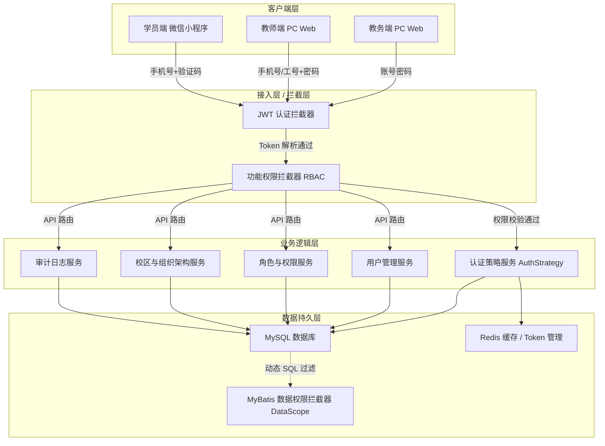

# ChordSked 里程碑 1：总体系统架构设计

**版本**: v1.0  
**创建日期**: 2026-03-25  
**状态**: 设计中  

---

## 1. 架构设计概述

本架构设计基于 ChordSked 里程碑 1 的需求，核心聚焦于**账号权限体系**建设，为后续业务功能开发提供稳定、安全、可扩展的基础架构支撑。

系统采用经典的分层架构设计，并结合面向对象的设计模式，以满足多端（教务端、教师端、学员端）独立账号体系的认证、授权及数据隔离需求。

### 1.1 核心设计目标
- **高内聚低耦合**：认证授权逻辑与业务逻辑分离。
- **可扩展性**：支持未来新增多种登录方式（如微信一键登录等）及新的业务模块接入。
- **安全性**：实现细粒度的功能权限拦截与数据隔离机制。

---

## 2. 总体架构图

系统后端采用经典的 MVC 分层架构，并在网关/拦截器层统一处理安全认证。

---

## 3. 全局技术规范与高可用设计

为了支撑系统在生产环境的稳定运行，系统级架构引入以下规范：

### 3.1 事务管理策略
- **本地事务**：主要通过 Spring 的 `@Transactional` 注解实现声明式事务，隔离级别默认使用 `READ_COMMITTED`，传播行为使用 `REQUIRED`。对于关键写入操作，必须在 Service 层统一处理事务。
- **事务失效防范**：避免在同一个类中进行内部方法调用（通过 AopContext.currentProxy() 解决），确保异常能正确向外抛出以触发回滚。

### 3.2 多实例部署与缓存管理 (高可用设计)
- **无状态服务设计**：应用服务器（App Server）必须完全无状态。
- **通用缓存服务**：引入统一的缓存管理组件（如 `CacheService` 接口），底层基于 Redis。集中管理用户的登录 Token 状态、验证码、系统字典及全局配置信息，确保请求分发到任意实例均能正常处理。
- **分布式锁**：在多实例场景下，对于竞争资源（如防止用户重复创建），使用 Redisson 提供基于 Redis 的分布式锁。

### 3.3 统一用户服务 (账号类型注册制)
- **分散管理痛点**：由于存在教务、教师、学员三套独立表，容易导致用户鉴权、信息查询逻辑散落在各个模块中。
- **统一服务设计**：构建统一的 `UserService`，内部采用**“账号类型注册制”**（或策略模式）。各端专属的用户服务（如 `TeacherUserService`）在启动时，将自身按 `UserType` 注册到统一的 `UserService` 中。
- **收益**：鉴权拦截器或通用业务模块只需与统一的 `UserService` 交互，由其根据 `UserType` 动态路由到底层具体实现，大幅降低系统耦合度。

### 3.4 接口统一返回格式
为了前端解析的统一性，所有 Controller 层接口必须返回统一的结构化数据（详见 `05-统一用户服务与异常处理设计.md`）。

### 3.5 全局异常处理机制
提供统一的 `@RestControllerAdvice` 和 `GlobalExceptionHandler` 进行全局异常拦截，将所有异常包装为结构化 JSON 响应（详见 `05-统一用户服务与异常处理设计.md`）。

### 3.6 全局幂等性与防重复提交设计
作为基础设施组件，系统在全局层面提供幂等性保证，防止网络抖动导致的脏数据（基于 Redis Lua 脚本实现，详见 `06-高可用与基础设施设计.md`）。

### 3.7 链路追踪与监控告警设计
- **TraceId 链路追踪**：通过 Filter 结合 MDC 实现跨层级的 TraceId 透传（详见 `06-高可用与基础设施设计.md`）。
- **监控与告警**：集成 Spring Boot Actuator、Prometheus 与 ELK，结合企业微信机器人触发实时告警。

### 3.8 统一 ID 生成器组件设计
基于雪花算法 (Snowflake) 或 Redis 号段模式，生成全局唯一 64 位长整型 ID，并无缝集成至 MyBatis-Plus（详见 `06-高可用与基础设施设计.md`）。

### 3.9 API 版本管理与限流熔断设计
- **API 版本管理**：通过自定义 `RequestMappingHandlerMapping` 实现优雅的版本路由控制。
- **限流熔断**：基于 Redis/Sentinel 实现防刷短信、防暴力破解等安全限流（详见 `06-高可用与基础设施设计.md`）。

### 3.10 数据字典与枚举统一管理
将所有非核心业务的状态值抽象为 `sys_dict` 字典项进行统一管理与 Redis 缓存（详见 `06-高可用与基础设施设计.md`）。

---

## 4. 子模块设计文档导航

为保持文档结构的清晰，我们将各个核心模块的详细设计拆分至独立的文档中。请参阅以下链接了解各模块的详细设计：

- [01-认证与多账号体系对接设计](01-认证与多账号体系对接设计.md)
  - 涵盖多端独立账号体系设计、认证策略模式应用、Spring Security 对接设计等。
- [02-授权与数据隔离设计](02-授权与数据隔离设计.md)
  - 涵盖功能权限拦截（RBAC）、动态数据权限隔离策略组件化机制。
- [03-核心领域模型](03-核心领域模型.md)
  - 涵盖底层用户、角色、校区绑定的 ER 领域模型及数据库规范设计。
- [04-审计日志模块设计](04-审计日志模块设计.md)
  - 涵盖系统操作日志与核心审计日志分离、AOP 自动记录及表结构。
- [05-统一用户服务与异常处理设计](05-统一用户服务与异常处理设计.md)
  - 涵盖账号类型注册制服务路由、全局统一响应结构与异常拦截处理类图。
- [06-高可用与基础设施设计](06-高可用与基础设施设计.md)
  - 涵盖全局幂等性、TraceId 链路追踪、ID生成器、API 版本控制、限流及数据字典设计的完整类图与时序流程。