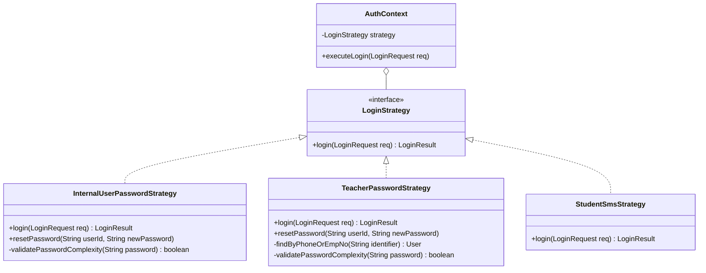
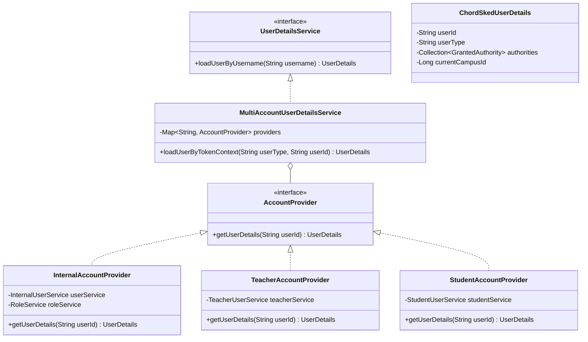
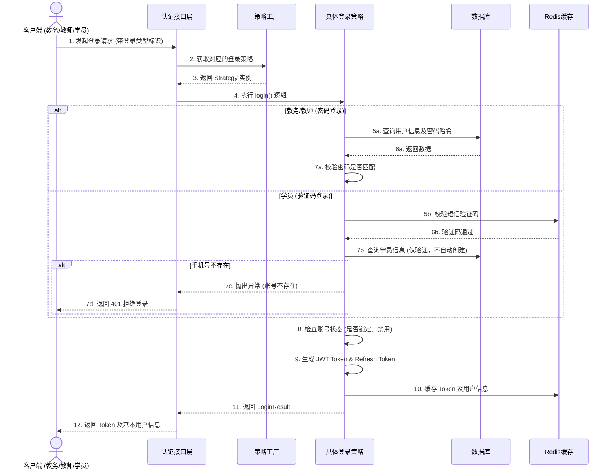
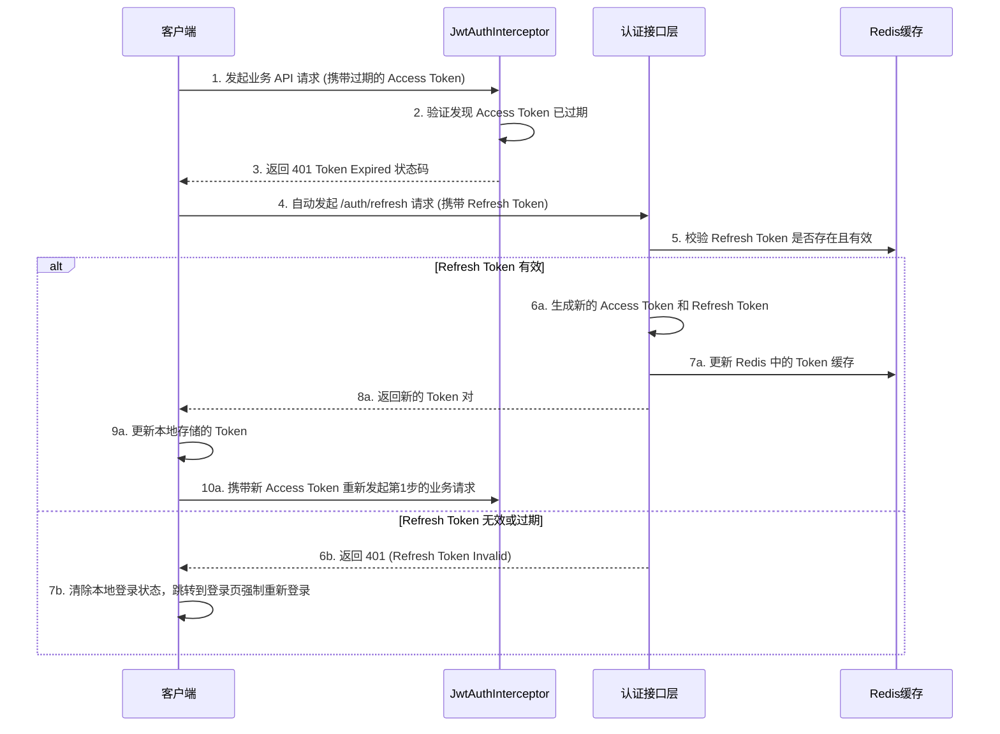

# 01-认证与多账号体系对接设计

---

## 1. 策略模式 (Strategy Pattern) - 认证模块

**场景**：系统存在三套独立的账号体系和不同的登录方式（密码登录、短信验证码登录，其中教师端支持手机号或工号登录）。
**设计**：定义统一的 `LoginStrategy` 接口，不同的登录方式实现该接口。
**优势**：符合开闭原则，未来如果增加微信一键登录，只需新增一个策略实现类即可，无需修改原有逻辑。

---

## 2. 安全框架与多账号体系对接设计

由于 ChordSked 存在三套完全独立的账号体系（教务端、教师端、学员端），且仅教务端需要复杂的 RBAC 角色权限控制，传统的单表用户设计（如标准 Spring Security）难以直接适配。因此，系统在对接安全框架时，采用**“统一网关鉴权 + 业务端独立提供权限数据”**的设计思想。

**框架选型建议**：使用 **Spring Security 结合 JWT**。

### 2.1 核心对接思想

1. **统一 Token 载荷设计**：JWT 中必须包含 `UserType`（标识是教务、教师还是学员）和 `UserId`。
2. **多 Realm / 多 UserDetailsService 策略**：安全框架不再直接绑定单张 User 表，而是通过 `UserType` 动态路由到不同的服务加载用户信息。
3. **权限加载策略**：
   - 教务端 (`ADMIN`): 根据 `UserId` 查 `sys_internal_user`，并关联查询 `sys_role` 和 `sys_permission`，动态加载完整的 GrantedAuthority 列表。这是唯一经过角色配置流程的账号体系。
   - 教师端 (`TEACHER`): 根据 `UserId` 查 `sys_teacher_user`，硬编码赋予一个特殊的内置标识（如 `ROLE_TEACHER`），不需要细粒度权限点，**不经过**角色配置流程。
   - 学员端 (`STUDENT`): 根据 `UserId` 查 `sys_student_user`，硬编码赋予内置标识（如 `ROLE_STUDENT`），**不经过**角色配置流程。

### 2.2 缓存一致性策略 (Redis)

在多实例部署下，用户认证状态及权限信息依赖 Redis 缓存，必须保证缓存与数据库的一致性：
1. **Token 生命周期**：登录时生成 JWT Token 并在 Redis 中记录会话状态，设置绝对过期时间（如 2 小时）。
2. **主动失效策略**：当教务端管理员在后台修改了某用户的权限（如变更角色）或禁用了某用户账号时，系统必须**主动删除或刷新**该用户在 Redis 中的权限缓存和 Token 会话状态，强制其重新拉取最新权限或下线。
3. **缓存击穿防护**：针对权限查询，如果 Redis 未命中，数据库查询时需做防击穿处理（如缓存空值并设置短过期时间）。

### 2.3 对接架构类图设计

---

## 3. 核心交互时序图

### 3.1 多端统一登录与 Token 签发流程

### 3.2 Refresh Token 无感刷新机制

为了兼顾安全性和用户体验，系统采用双 Token 机制。当 Access Token 过期时，客户端可使用 Refresh Token 换取新的 Token 对。

