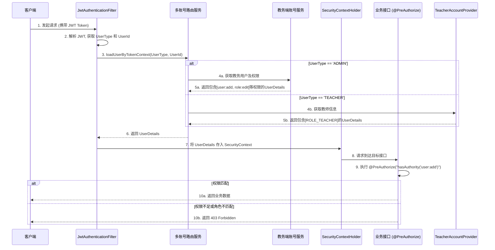
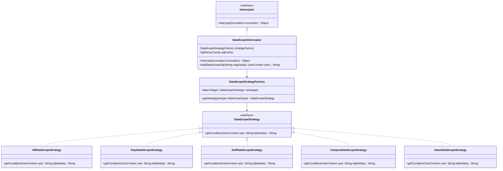
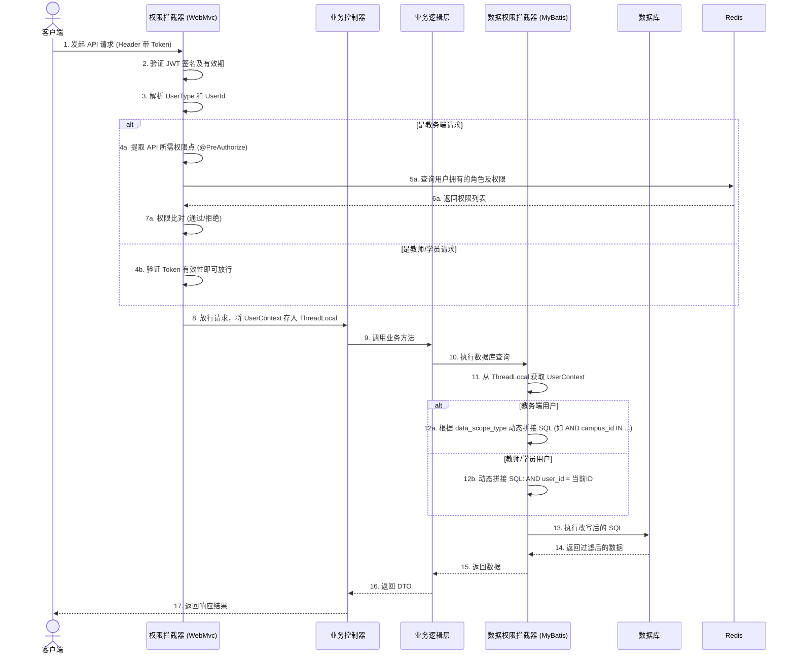

# 02-授权与数据隔离设计

---

## 1. 责任链模式/拦截器模式 (Interceptor Pattern) - 授权模块

**场景**：API 请求需要经过 Token 校验、角色权限校验。
**设计**：采用轻量级安全框架（如 Sa-Token 或基于 Spring Security 深度定制），统一处理鉴权流程。
- `JwtAuthInterceptor`：负责解析 Token，识别用户身份。
- `PermissionInterceptor`：针对教务端用户，拦截 API 并比对角色拥有的权限点（RBAC）。

---

## 2. 授权验证执行流程

当一个请求到达系统时，安全框架的拦截流程如下：

### 2.1 对接优势
- **隔离性好**：安全框架层不关心底层的三张表结构，只面向抽象的 `AccountProvider` 接口。
- **配置简化**：教师端和学员端的 API 只需配置 `@PreAuthorize("hasRole('TEACHER')")` 即可放行所有相关接口，而教务端则可精确到 `@PreAuthorize("hasAuthority('role:create')")`。

---

## 3. 策略模式 + 代理模式 - 数据权限隔离组件化

**场景**：不同角色的数据权限范围不同，且未来可能扩展更多维度（如基于部门、区域甚至特定属性）。
**设计**：将数据权限隔离 `DataScope` 抽取为独立的通用组件。利用 MyBatis 的 Interceptor（代理模式）拦截 SQL，并结合**策略模式**（Strategy Pattern）处理不同的权限范围过滤逻辑，实现与业务代码的解耦。

### 3.1 核心组件类图设计

### 3.2 核心组件说明
1. **统一拦截器 `DataScopeInterceptor`**：
   - 仅对标注了 `@DataScope` 注解的 Mapper 方法进行拦截。
   - 解析注解信息，获取当前用户的 `data_scope_type`，将其分发给对应的策略实现类。
2. **策略接口与实现 (`DataScopeStrategy`)**：
   - 定义 `DataScopeStrategy` 接口，包含 `getCondition(User user, String tableAlias)` 方法。
   - 实现不同的策略类：
     - `AllDataScopeStrategy` (全公司)：返回空条件。
     - `DeptDataScopeStrategy` (本部门及下级)：返回 `AND dept_id IN (...)`。
     - `SelfDataScopeStrategy` (本人)：返回 `AND create_by = 当前登录者ID`。
     - `CampusDataScopeStrategy` (指定校区)：返回 `AND campus_id IN (...)`。
3. **预留 ABAC 扩展点 (Attribute-Based Access Control)**：
   - `DataScope` 组件在设计时，上下文上下文不仅传递用户 ID 和角色，还包含环境上下文（如当前时间、请求 IP）及用户属性集合。
   - 未来若需基于属性控制权限（如：只允许在特定网络环境下查看高价值学员数据），只需新增一个 `AbacDataScopeStrategy` 策略类，解析这些属性并生成对应的 SQL 条件即可，无需重构现有架构。

**性能优化设计**：
- **SQL AST 解析缓存**：针对复杂 SQL，使用 JSqlParser 等 AST 工具解析时性能损耗较大。系统应对“原始 SQL -> 注入点 AST 结构”的映射关系进行**本地缓存 (如 Caffeine/ConcurrentHashMap)**，同一条 SQL 在二次执行时直接复用解析结果进行条件拼接。

### 3.3 权限校验与数据隔离执行流程

