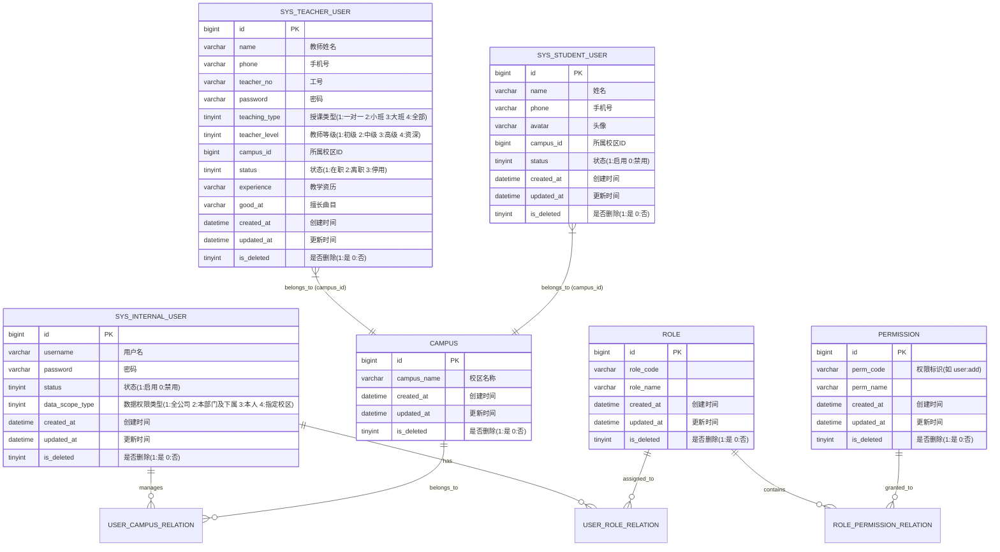

# 03-核心领域模型

---

## 1. 核心领域模型 (RBAC及多账号体系)

根据需求，角色仅关联功能权限，数据权限在用户级配置（通过校区关联）。三类用户分表存储。

## 2. 数据库设计规范

### 2.1 字段命名与基础规范
为了保证数据库的统一性和可维护性，所有表设计必须遵循以下规范：
- **主键**：统一命名为 `id`。
- **外键关联**：统一使用 `{关联表名}_id` 格式（如 `campus_id`, `user_id`）。
- **时间审计字段**：所有核心业务表必须包含 `created_at` (创建时间) 和 `updated_at` (更新时间)。
- **逻辑删除**：统一使用软删除策略，核心业务表必须包含 `is_deleted` (布尔值：1表示已删除，0表示未删除) 字段。
- **布尔值**：统一以 `is_` 开头（如 `is_deleted`, `is_primary`）。
- **枚举/状态**：统一命名为 `status` 或 `{业务}_type`（如 `user_type`, `data_scope_type`）。

### 2.2 高频查询索引设计
为保证系统性能，需针对核心表的高频查询条件建立索引：
1. **唯一索引 (Unique Index)**：
   - `sys_internal_user.username`
   - `sys_teacher_user.phone`
   - `sys_student_user.phone`
2. **普通索引 (Normal Index)**：
   - 所有外键关联字段：如 `campus_id`。
   - 高频查询状态字段：如 `status`, `is_deleted`。
   - 联合索引：针对角色权限关联表 `sys_role_permission` 建立 `(role_id, perm_id)` 联合索引。