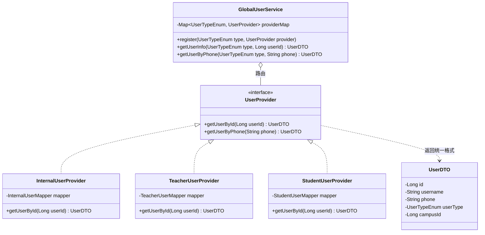
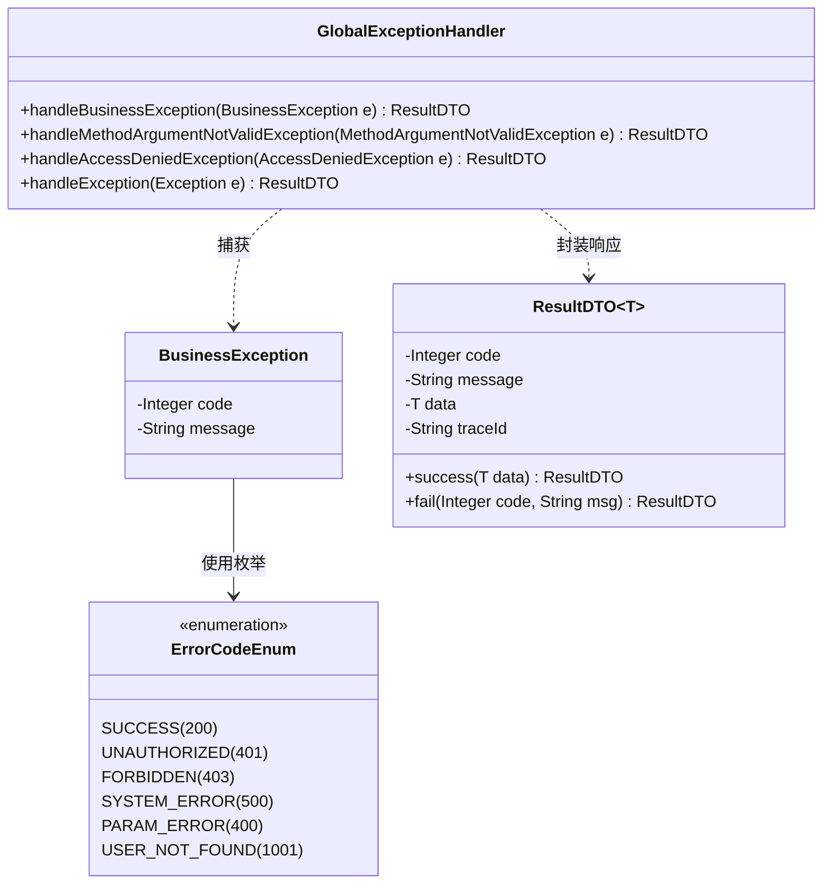

# 05-统一用户服务与异常处理设计

本部分设计解决多账号体系导致的用户查询散落问题，以及系统层面的全局异常处理与接口返回规范。

---

## 1. 统一用户服务设计 (账号类型注册制)

### 1.1 痛点与设计目标
- **痛点**：教务端（`sys_internal_user`）、教师端（`sys_teacher_user`）、学员端（`sys_student_user`）的数据分布在不同表中。如果其他模块（如鉴权拦截器、消息通知模块）需要获取用户信息，往往需要编写冗长的 `if-else` 来调用不同的 Service，导致强耦合。
- **设计目标**：构建一个全局的门面服务 `GlobalUserService`，业务模块只需提供 `userId` 和 `userType`，即可通过门面服务透明地获取用户信息，底层不同表的查询逻辑被完全封装。

### 1.2 核心类图设计 (策略模式)



### 1.3 注册与执行流程
1. **服务注册 (启动时)**：`InternalUserProvider` 等实现类在 Spring 启动时（通过 `@PostConstruct` 或 `InitializingBean`），主动调用 `GlobalUserService.register()` 方法将自己注册进去。
2. **服务调用 (运行时)**：认证模块在验证 Token 获取到 `userId=1001` 且 `userType=TEACHER` 后，调用 `GlobalUserService.getUserInfo(TEACHER, 1001)`。`GlobalUserService` 内部通过 Map 路由到 `TeacherUserProvider` 进行查询，并返回统一的 `UserDTO`。

---

## 2. 全局异常处理与统一返回设计

### 2.1 统一返回数据结构
所有 Controller 层 API 返回的数据，必须经过无侵入式包装（基于 `ResponseBodyAdvice`），确保前端解析逻辑统一。

```json
{
  "code": 200,                // 业务状态码 (200成功，401未登录，403无权限，500内部错误，1001业务异常等)
  "message": "操作成功",        // 提示信息
  "data": {                   // 业务数据载荷 (失败时可为 null)
      "id": 1,
      "name": "张三"
  },            
  "traceId": "a1b2c3d4e5f6"   // 链路追踪 ID，方便生产环境排查日志
}
```

### 2.2 全局异常处理类图



### 2.3 异常处理逻辑说明
- `@RestControllerAdvice` 拦截所有 Controller 抛出的异常。
- **业务异常 (`BusinessException`)**：提取其中自定义的 `code` 和 `message` 返回给前端（如：库存不足、用户不存在）。
- **参数校验异常 (`MethodArgumentNotValidException`)**：拦截 `@Valid` / `@Validated` 触发的校验失败，提取字段错误信息（如“手机号格式不正确”），统一返回 `400` 状态码。
- **未知系统异常 (`Exception`)**：记录 `ERROR` 级别日志（包含堆栈信息和 `traceId`），并向前端返回 `500 系统繁忙，请稍后再试`，防止敏感堆栈信息泄露。