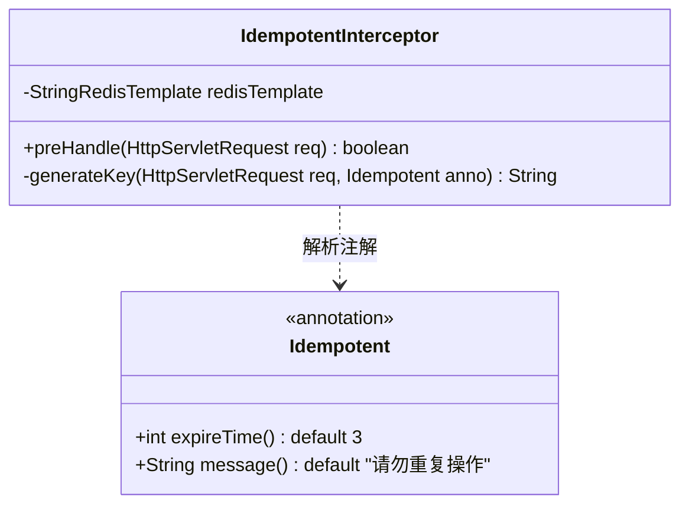
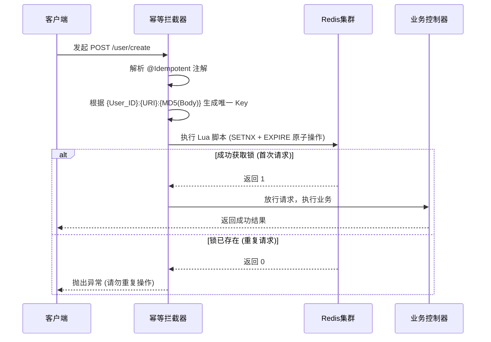
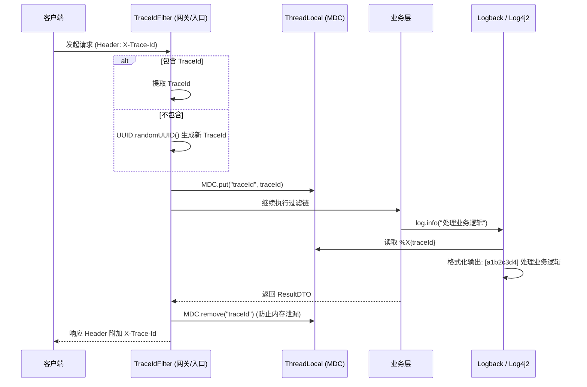
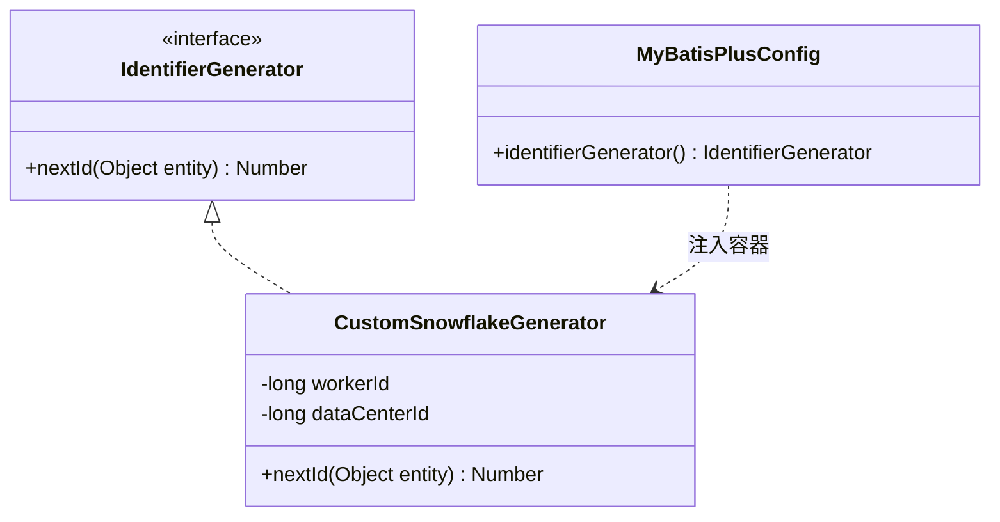
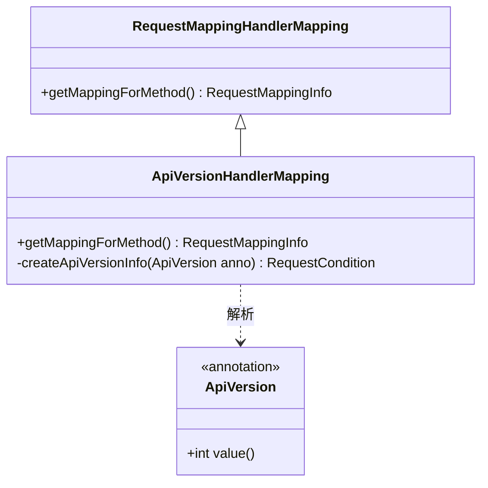
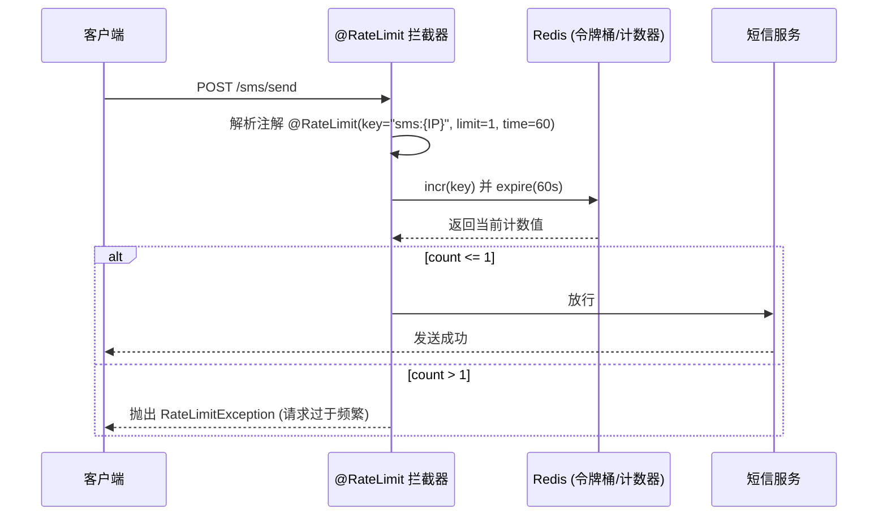
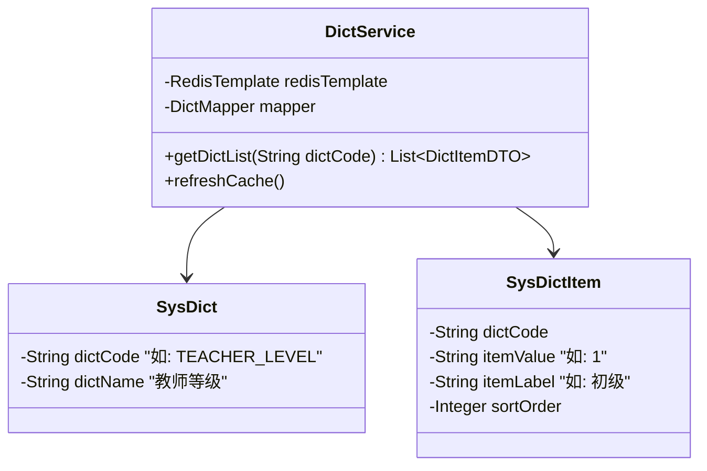

# 06-高可用与基础设施设计

本部分设计涵盖支撑系统高并发、高可用及可观测性的底层核心组件。

---

## 1. 全局幂等性与防重复提交设计

**场景**：前端快速双击、网络超时重试等情况会导致敏感操作（如用户创建、排课等）被重复执行。
**设计**：提供基于 Redis + Lua 脚本的 `@Idempotent` 注解，实现细粒度的防重拦截。

### 1.1 幂等性组件类图

### 1.2 执行流程 (Lua 脚本保证原子性)

---

## 2. TraceId 链路追踪机制

**场景**：微服务或多模块下，由于日志交织，极难排查单个用户的请求生命周期。
**设计**：通过 `Filter` 和 `MDC` 实现全链路的 TraceId 透传。

### 2.1 核心执行流程

---

## 3. 统一 ID 生成器设计

**场景**：MySQL 自增主键在多实例或未来分库分表场景下会产生冲突，且容易暴露业务数据量。
**设计**：引入基于雪花算法（Snowflake）或 Redis 号段的分布式 ID 生成器，无缝集成到 MyBatis-Plus。

### 3.1 核心类图

*(注：为防止前端 JS 丢失 64 位整型精度，所有实体类的 `Long id` 需打上 `@JsonSerialize(using = ToStringSerializer.class)` 标签。)*

---

## 4. API 版本管理

**场景**：微信小程序端无法强制用户同步更新，后端接口升级时必须兼容旧版本。
**设计**：基于 URI 路径（如 `/v1/`, `/v2/`）或自定义的 `RequestMappingHandlerMapping` 实现多版本控制。

---

## 5. 限流熔断机制

**场景**：防范恶意刷短信接口（浪费资金）及账号密码暴力破解。
**设计**：基于 Redisson 或 Sentinel 实现分布式限流。

### 5.1 限流时序逻辑 (防刷短信示例)

---

## 6. 数据字典统一管理

**场景**：状态枚举（如授课类型 1:一对一, 2:小班）硬编码会导致多端文案不一致，修改成本高。
**设计**：将基础配置收敛到 `sys_dict` 和 `sys_dict_item` 表，配合 Redis 缓存供前端动态渲染。

### 6.1 字典管理类图

